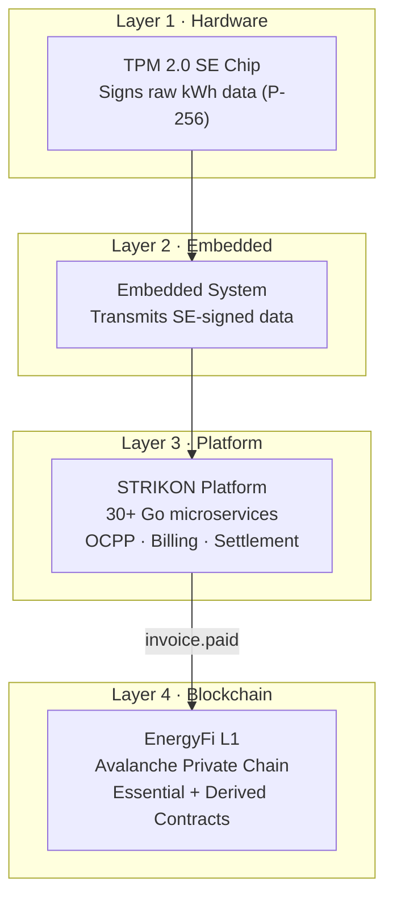
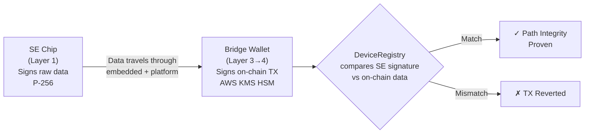
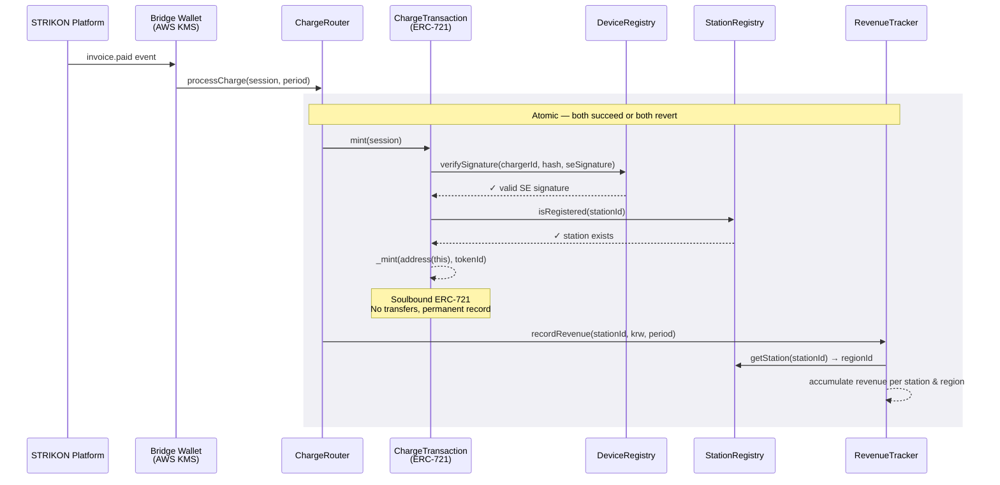
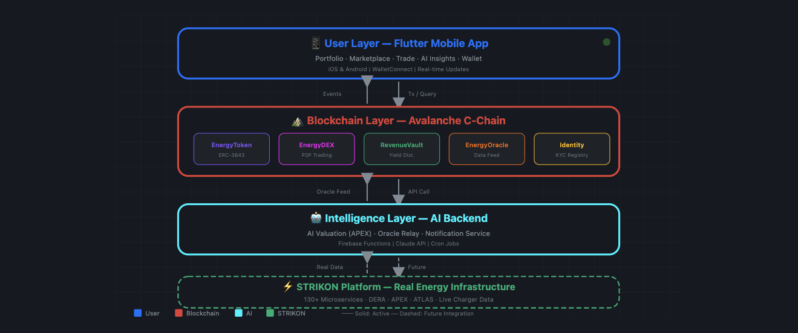
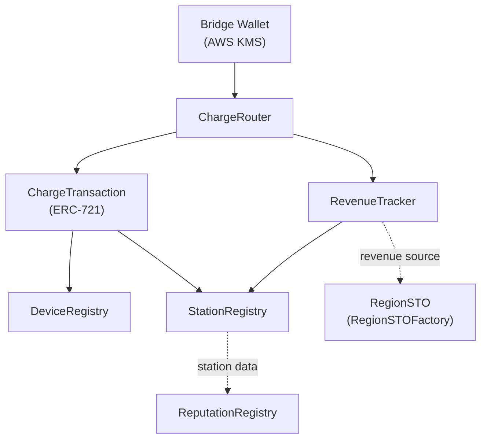

<div align="center">

# EnergyFi

### Hardware-to-Blockchain Vertical Stack for EV Charging Infrastructure Tokenization

<br/>


<br/>

[](https://www.avax.network/)
[](https://en.wikipedia.org/wiki/Trusted_Platform_Module)
[](https://soliditylang.org/)
[](https://hardhat.org/)
[](https://expo.dev/)
[](contracts/test/)

</div>

---

## Try It Yourself

Mint 3 EV charging sessions on our live Avalanche L1 and verify them on the explorer:

```bash
cd contracts && npm install && npm run demo
```

The script processes 3 charging sessions through the full pipeline (SE signature → ChargeRouter → mint + revenue tracking), then prints explorer links for each transaction. Run it multiple times — each run creates new sessions.

> Requires Node.js 24.x and a configured `.env` (see [Environment Setup](docs/environment-setup.md))

## Public MVP Verification

- Live MVP: [https://energyfi-mobile-demo.vercel.app](https://energyfi-mobile-demo.vercel.app)
- Quick review guide: [docs/judge-quick-start.md](./docs/judge-quick-start.md)
- Contract deployment evidence: [docs/contract-deployment-links.md](./docs/contract-deployment-links.md)

Current public MVP network:

- Chain ID: `64058`
- RPC: [https://subnets.avax.network/efy/testnet/rpc](https://subnets.avax.network/efy/testnet/rpc)
- Explorer: [https://explorer-test.avax.network/efy](https://explorer-test.avax.network/efy)

## What is EnergyFi?

A blockchain protocol that records EV charging infrastructure settlement data on-chain via a hardware-anchored trust chain (TPM 2.0 SE → STRIKON platform → Avalanche L1). Every charging session is cryptographically signed at the hardware level and immutably recorded per-session upon payment settlement.

---

## How It Works — The Vertical Stack

EnergyFi is not just smart contracts. It is a **4-layer vertical stack** where hardware, embedded systems, platform software, and blockchain work as a single pipeline.



**Layer 1 — Hardware**: A TPM 2.0 Secure Element chip embedded in every charger signs raw metering data (kWh, timestamps) using P-256 (secp256r1) cryptography. This signature is created at the point of physical measurement — before the data ever leaves the device.

**Layer 2 — Embedded**: The proprietary embedded system transmits the SE-signed data packet to the platform. The hardware signature travels intact through this layer.

**Layer 3 — Platform**: STRIKON, a production EV charging platform with 30+ Go microservices, handles charger management (OCPP 1.6/2.1), billing, payment processing, and settlement. Only after a payment is fully settled does it emit an `invoice.paid` event.

**Layer 4 — Blockchain**: EnergyFi's dedicated Avalanche L1 (Chain ID 270626, zero-gas) receives the settled data via a Bridge wallet and records it immutably through the contract surface defined in `contracts/docs/`.

### Bookend Signature Model

How do we guarantee the data wasn't tampered with between the charger and the blockchain?

We don't need to trust every intermediate layer. Instead, we verify at **both endpoints**:



The SE chip (origin) and Bridge wallet (destination) form a **bookend**. If the data at both ends matches, the entire intermediate path is proven intact — without requiring signatures at every hop.

### Data Pipeline: Charging Session → On-Chain Record

When a charging session is paid, here is exactly what happens on-chain:



**Atomicity**: If the SE signature is invalid, the station is unregistered, or any check fails — the entire transaction reverts. No partial records ever exist on-chain.

<div align="center">

</div>

> Canonical architecture references: [docs/README.md](docs/README.md), [contracts/docs/README.md](contracts/docs/README.md)
---

## Smart Contract Architecture

Every contract exists because a specific business requirement demanded it. Here is the mapping:

| Business Requirement | Contract | Design Rationale |
|:---|:---|:---|
| **Prevent charger data tampering** | `DeviceRegistry` | Pre-enrolls SE chip public keys (P-256, 64 bytes). Verifies hardware signature on every charging session |
| **Map stations to investment regions** | `StationRegistry` | Groups stations by 17 Korean administrative regions (ISO 3166-2:KR). Region = STO investment unit |
| **Immutably record settled payments** | `ChargeTransaction` | Soulbound ERC-721 — one token per session, no transfers, permanent record |
| **Aggregate revenue per region** | `RevenueTracker` | Accumulates distributable KRW per station and per region. Source data for STO investors |
| **Single trusted entry point** | `ChargeRouter` | Atomically executes mint + recordRevenue in one TX. `onlyBridge` access control |
| **Issue per-region security tokens** | `RegionSTO` + `RegionSTOFactory` | Current code includes an ERC-20-based prototype, but final token standard and issuance location remain policy-dependent |
| **Station operational quality** | `ReputationRegistry` | Oracle-published region metrics (trust, rhythm, site scores) |

### Current Demo Surface

The current public demo deployment exposes 8 contracts. The full phased contract map, including held/optional surfaces, is maintained in [contracts/docs/implementation-roadmap.md](contracts/docs/implementation-roadmap.md).

| Phase | Category | Contract | Token Standard | Status |
|:---|:---|:---|:---|:---|
| 1 | Infrastructure | **DeviceRegistry** | — | Deployed |
| 1 | Infrastructure | **StationRegistry** | — | Deployed |
| 2 | Transaction | **ChargeRouter** | — | Deployed |
| 2 | Transaction | **ChargeTransaction** | ERC-721 (Soulbound) | Deployed |
| 2 | Revenue | **RevenueTracker** | — | Deployed |
| 3 | Investment | **RegionSTO** | ERC-20 prototype | Deployed (policy hold) |
| 3 | Investment | **RegionSTOFactory** | — | Deployed |
| 4 | Operations | **ReputationRegistry** | — | Deployed |

### Contract Dependency Graph



**Essential contracts** (solid lines): DeviceRegistry, StationRegistry, ChargeTransaction, RevenueTracker, ChargeRouter — the core data pipeline. Without these, the system cannot operate.

**Derived contracts** (dashed lines): RegionSTO, RegionSTOFactory, and ReputationRegistry consume data produced by the essential contracts.

### Key Design Decisions

- **Soulbound ERC-721**: Charging sessions are immutable evidence, not tradeable assets. Minted to `address(this)`, transfers disabled.
- **UUPS Proxy**: All contracts are upgradeable via UUPS pattern for post-deployment bug fixes and regulatory adaptation.
- **`BridgeGuarded` base contract**: The Bridge wallet (AWS KMS HSM) is the sole trusted entry point from STRIKON. `onlyBridge` modifier on all write operations.
- **Zero-gas private chain**: Chain ID 270626. Per-session data recording triggered by `invoice.paid`. Gas optimization is irrelevant — investor protection takes priority.

---

## Investor Mobile App

<div align="center">

| Spec | Detail |
|:---|:---|
| **Stack** | React Native + Expo SDK 54, TypeScript |
| **Routing** | expo-router v6 (4 tabs) |
| **i18n** | Korean + English |
| **Platforms** | iOS, Android, Web |

</div>

**Tabs**: Home (real-time impact data) · Explore (region reputation) · Portfolio (STO holdings) · Account (settings, KYC docs)

---

## Testing

Test counts change over time, so this README does not freeze them. Use `cd contracts && npm test` or CI as the current source of truth.

Key coverage areas:
- DeviceRegistry P-256 / secp256k1 enrollment and signature verification
- ChargeRouter atomicity across `ChargeTransaction` and `RevenueTracker`
- Station/region mapping and revenue accumulation invariants
- RegionSTO and ReputationRegistry demo surfaces

---

## Why Avalanche?

| Need | Avalanche Solution |
|:---|:---|
| **Dedicated L1** | Sovereign private chain per use case — isolated from public chain congestion |
| **Zero gas** | No transaction fees for on-chain data recording — critical for per-session writes |
| **Absolute finality** | BFT consensus — once confirmed, data is never reorganized or reverted |
| **Managed infrastructure** | AvaCloud — managed validators, monitoring, RPC endpoints without DevOps overhead |

---

## Quick Start

```bash
# Prerequisites: Node.js 24.x (nvm use 24)
git clone https://github.com/Seon-ung/EnergyFi.git
cd EnergyFi

# Smart Contracts
cd contracts
npm install
npx hardhat compile
npx hardhat test

# Investor Mobile App
cd ../mobile
npm install
npx expo start                                # iOS / Android / Web
```

> Full setup guide: [Environment Setup](docs/environment-setup.md)

---

## Project Structure

```
EnergyFi/
├── contracts/                  # Avalanche L1 smart contracts (Solidity, Hardhat 3)
│   ├── contracts/
│   │   ├── infra/              #   DeviceRegistry, StationRegistry
│   │   ├── core/               #   ChargeTransaction, ChargeRouter
│   │   ├── finance/            #   RevenueTracker
│   │   ├── sto/                #   RegionSTO, RegionSTOFactory
│   │   ├── ops/                #   ReputationRegistry
│   │   ├── base/               #   BridgeGuarded (shared access control)
│   │   └── interfaces/         #   All contract interfaces
│   ├── test/
│   │   ├── unit/               #   Contract unit tests
│   │   └── integration/        #   Cross-contract integration tests
│   ├── scripts/                #   Deployment & seeding scripts
│   └── tools/dashboard/        #   Express web dashboard + CLI
├── mobile/                     # React Native + Expo SDK 54 (TypeScript)
│   ├── app/                    #   expo-router screens
│   ├── components/             #   UI building blocks
│   └── hooks/                  #   Data/view hooks
├── l1-config/                  # L1 chain configuration
│   ├── genesis.json            #   Chain ID 270626, zero-gas, RIP-7212
│   └── config.json
└── docs/                       # Architecture & specification documents
```

## Documentation

| Document | Description |
|:---|:---|
| [Root Docs Map](docs/README.md) | Canonical root-level document graph |
| [Contracts Docs Map](contracts/docs/README.md) | Canonical contract doc graph and reading order |
| [Architecture](docs/architecture.md) | 4-layer system architecture, trust chain, data flows |
| [Implementation Roadmap](contracts/docs/implementation-roadmap.md) | Phase-by-phase contract specification, dependency graph |
| [STRIKON Interface Spec](docs/strikon-interface-spec.md) | 5-step data pipeline: charger → invoice.paid |
| [Phase 1 Spec](contracts/docs/phase1-infra-spec.md) | DeviceRegistry + StationRegistry |
| [Phase 2 Spec](contracts/docs/phase2-transaction-spec.md) | ChargeTransaction + RevenueTracker + ChargeRouter |
| [Phase 3 Spec](contracts/docs/phase3-sto-spec.md) | STO issuance + Revenue Attestation infrastructure |
| [Phase 4 Reputation Spec](contracts/docs/phase4-reputation-spec.md) | Explore reputation snapshot interface and metric model |
| [Phase 5 Spec](contracts/docs/phase5-carbon-spec.md) | Carbon credit pipeline (Verra VCS VM0038) |
| [Environment Setup](docs/environment-setup.md) | Prerequisites, toolchain, network configuration |

---

## License

MIT © 2026 Wingside AI EnergyFi Team
