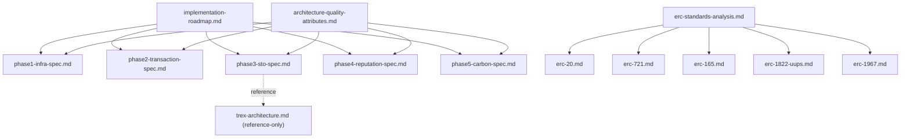

# Contracts Docs Map

## Purpose

`contracts/docs/` is the **canonical documentation set for the smart-contract layer**.
Documents in this directory should be read in three categories.

- `Canonical`: documents that describe the current implementation or currently approved policy
- `Reference-only`: supporting material for future-path evaluation
- `Archive`: historical design notes or work memos that no longer match the current architecture

## Canonical Set

| Category | Document | Role |
|:---|:---|:---|
| Roadmap | [implementation-roadmap.md](implementation-roadmap.md) | The primary source for phases, dependencies, policies, and risks |
| Phase Spec | [phase1-infra-spec.md](phase1-infra-spec.md) | DeviceRegistry + StationRegistry canonical spec |
| Phase Spec | [phase2-transaction-spec.md](phase2-transaction-spec.md) | ChargeTransaction + RevenueTracker + ChargeRouter canonical spec |
| Phase Spec | [phase3-sto-spec.md](phase3-sto-spec.md) | STO issuance boundary + Revenue Attestation spec |
| Phase Spec | [phase4-reputation-spec.md](phase4-reputation-spec.md) | ReputationRegistry snapshot spec |
| Phase Spec | [phase5-carbon-spec.md](phase5-carbon-spec.md) | Carbon pipeline spec |
| Quality Gate | [architecture-quality-attributes.md](architecture-quality-attributes.md) | Evaluation criteria for design, implementation, and review |
| Standards Index | [erc-standards-analysis.md](erc-standards-analysis.md) | Index of applied ERC standards |
| Standards Detail | [erc-20.md](erc-20.md), [erc-721.md](erc-721.md), [erc-165.md](erc-165.md), [erc-1822-uups.md](erc-1822-uups.md), [erc-1967.md](erc-1967.md) | Standard-by-standard explanations |

## Reference-only

| Document | Why It Exists | Reading Rule |
|:---|:---|:---|
| [trex-architecture.md](trex-architecture.md) | ERC-3643 / T-REX evaluation material | Do not treat it as higher priority than the current implementation or current policy. Reference only until the issuance path is finalized. |

## Archive

| Location | Meaning |
|:---|:---|
| [`archive/`](archive/) | Documents that conflict with current policy or were only valid during a past refactor window |

## Document Graph

## Reading Order

1. [implementation-roadmap.md](implementation-roadmap.md)
2. The specific phase spec you need
3. [architecture-quality-attributes.md](architecture-quality-attributes.md)
4. If you need ERC material, continue with [erc-standards-analysis.md](erc-standards-analysis.md)

## Rules

- If a phase spec conflicts with [implementation-roadmap.md](implementation-roadmap.md), check the roadmap first.
- `reference-only` documents do not override canonical specs.
- `archive` documents must not be cited as current design authority.
