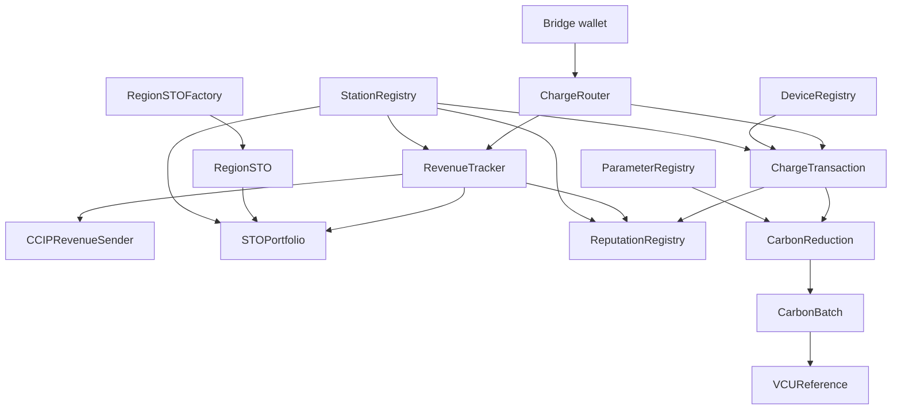

# Smart Contract Implementation Roadmap by Phase

## EnergyFi — ChargeTransaction-Centric Delivery Plan

2026.03.03 | Ver 3.1

---

## Purpose

This roadmap is the primary contract-layer planning document for EnergyFi. It does four things:

- defines the trust model for on-chain charging data
- separates essential contracts from derived contracts
- maps the dependency graph around `ChargeTransaction`
- fixes the scope and sequencing of Phases 1 through 5

If a phase spec conflicts with this document, treat this roadmap as the higher-priority planning reference and then check the phase spec for contract-level detail.

---

## 1. Dual-Signature Trust Model

EnergyFi relies on a bookend signature model. Charging data is trusted because the physical origin and the on-chain submission path are both signed.

### 1.1 Signature layers

| Layer | Signer | Key custody | Signed payload | On-chain verification | Guarantee |
|:---|:---|:---|:---|:---|:---|
| **Layer 1: Hardware** | TPM 2.0 SE chip | inside the chip, non-exportable | raw metering data (`kWh`, timestamps, charger context) | `DeviceRegistry.verifySignature()` from `ChargeTransaction.mint()` | proves that the data originated from the enrolled physical device |
| **Layer 2: Platform** | Bridge wallet | AWS KMS / HSM-backed custody | the full `ChargeRouter.processCharge()` transaction | `onlyBridge` modifier | proves that the authorized STRIKON pipeline submitted the record |

### 1.2 Trust evolution by phase

> **Design update (March 2026):** the platform and chargers launch together. Real SE chips are therefore present from Phase 1 onward. The old assumption that early sessions would use `seSignature = 0x` is retired.

| Phase | Period | Layer 1 status | Layer 2 status | Result |
|:---|:---|:---|:---|:---|
| **Phase 1** | through 2026.04 | `DeviceRegistry` deployed, chip public keys enrolled | not active yet because the charge write path is not deployed | trust chain prepared on-chain |
| **Phase 2** | 2026.04 to 2026.06 launch window | real SE signatures verified on-chain | `onlyBridge` enforced for every charging write | full bookend trust model active |
| **Phase 3** | from 2027.01 | unchanged | unchanged | STO issuance consumes the same trusted revenue substrate |
| **Phases 4-5** | 2027 H2 onward | unchanged | unchanged | derived analytics and carbon workflows reuse the same trust boundary |

### 1.3 Bookend verification flow

```text
TPM 2.0 SE chip
  -> signs raw charging data
  -> STRIKON gateway / settlement
  -> invoice.paid
  -> Bridge wallet signs the on-chain transaction
  -> ChargeRouter.processCharge()
  -> ChargeTransaction.mint() verifies the SE signature
  -> RevenueTracker.recordRevenue() updates revenue totals
```

The important point is that EnergyFi does not attempt to sign every intermediate handoff. Instead, it verifies the origin and the final submission. If both ends match the same session payload, the intermediate path is treated as intact.

### 1.4 AWS KMS bridge key management

| Topic | Policy |
|:---|:---|
| Key storage | AWS KMS HSM-backed key custody |
| Signing mode | KMS `Sign` API returns the ECDSA signature used for the transaction |
| Plaintext key exposure | not allowed outside KMS |
| Access control | Bridge service permissions only |
| Audit trail | CloudTrail logging for signing requests |
| Operational rationale | the Bridge remains a single controlled entry point, but key-exposure risk is reduced by HSM-backed custody |

---

## 2. Contract Classification

The contract system is organized around data production and data consumption.

- **Essential contracts** are required for the Phase 1-2 charging data pipeline to operate.
- **Derived contracts** consume, summarize, transmit, or reinterpret data produced by Essential contracts.

### 2.1 Essential contracts

| Contract | Role | Why it is essential |
|:---|:---|:---|
| **DeviceRegistry** | SE chip public-key registry | `ChargeTransaction` cannot verify SE signatures without it |
| **StationRegistry** | station / charger hierarchy and region mapping | region attribution and station validation depend on it |
| **ChargeTransaction** | session-level root record | produces the canonical charging-session dataset |
| **RevenueTracker** | station and region revenue aggregation | produces the canonical revenue dataset |
| **ChargeRouter** | atomic write router | guarantees `mint()` and `recordRevenue()` succeed or fail together |

### 2.2 Derived contracts

| Contract | Phase | Dependency | Role |
|:---|:---|:---|:---|
| **CCIPRevenueSender** | 3 | RevenueTracker (+ attestation payload assembly) | sends Revenue Attestation messages to the KSD-supported chain when the CCIP path is selected |
| **RegionSTO** | 3 | issuance path dependent | region-level security-token surface; the current repository contains an ERC-20-based prototype only |
| **RegionSTOFactory** | 3 | RegionSTO | factory for region token deployments if the token is issued on an EnergyFi-controlled ledger |
| **STOPortfolio** | 3 | RevenueTracker, RegionSTO, StationRegistry | investor-facing holdings and revenue view |
| **ReputationRegistry** | 4 | ChargeTransaction, RevenueTracker, StationRegistry, STRIKON ops data | stores region-level reputation snapshots for Explore |
| **ParameterRegistry** | 5 | independent parameter store | stores versioned VM0038 parameters |
| **CarbonReduction** | 5 | ChargeTransaction, ParameterRegistry | calculates and records reduction results |
| **CarbonBatch** | 5 | CarbonReduction | groups reductions into verification batches |
| **VCUReference** | 5 | CarbonBatch | append-only reference to Verra issuance results |

### 2.3 Dependency graph



### 2.4 Reading rule

When deciding whether a contract belongs in the current delivery scope, ask:

1. Does the Phase 1-2 charging pipeline break if this contract does not exist?
2. If not, does the contract consume or package data that the pipeline already produced?

If the answer to the first question is yes, it is Essential. If the answer to the second question is yes, it is Derived.

---

## 3. Phase Plan

### Phase 1: Infrastructure Registration

**Objective:** establish the root of trust and the station hierarchy on-chain.

| Item | Definition |
|:---|:---|
| Canonical contracts | `DeviceRegistry`, `StationRegistry` |
| Main outputs | enrolled SE chip keys, station records, charger records, region mapping |
| Business boundary | all on-chain stations are EnergyFi-owned; third-party CPO stations remain off-chain |
| Detailed spec | [phase1-infra-spec.md](phase1-infra-spec.md) |

Phase 1 fixes the prerequisites for every later phase. No later contract may relax the rule that unregistered stations and unenrolled chips invalidate the write path.

### Phase 2: Charging Transactions and Revenue

**Objective:** record charging sessions on-chain and update revenue aggregates atomically.

| Item | Definition |
|:---|:---|
| Canonical contracts | `ChargeTransaction`, `RevenueTracker`, `ChargeRouter` |
| Write trigger | STRIKON `invoice.paid` |
| Canonical write path | Bridge -> `ChargeRouter.processCharge()` |
| Detailed spec | [phase2-transaction-spec.md](phase2-transaction-spec.md) |

Confirmed rules:

- `ChargeTransaction` is a Soulbound ERC-721 record, not a consumer NFT
- `RevenueTracker` records only on-chain EnergyFi-owned station revenue
- `ChargeRouter` is the only Bridge entry point for the charging write path

### Phase 3: STO Issuance Boundary and Revenue Attestation

**Objective:** prepare the issuance layer without overcommitting to a token standard or ledger path before regulation and counterparties are finalized.

| Item | Definition |
|:---|:---|
| Canonical scope | issuance-path comparison, Revenue Attestation model, restart triggers |
| Planned contracts | `CCIPRevenueSender`; `RegionSTO` / `RegionSTOFactory` / `STOPortfolio` remain path-dependent |
| Business boundary | EnergyFi provides charging and revenue data; securities-firm-side KYC/AML, transfer control, and dividend execution remain out of scope |
| Detailed spec | [phase3-sto-spec.md](phase3-sto-spec.md) |

The current repository includes a `RegionSTO` implementation built on ERC-20, but that code should be treated as a prototype, not as proof that the final Phase 3 standard is fixed.

### Phase 4: Reputation Snapshots

**Objective:** publish region-level reputation snapshots for the Explore experience.

| Item | Definition |
|:---|:---|
| Canonical contract | `ReputationRegistry` |
| Data sources | ChargeTransaction, RevenueTracker, StationRegistry, STRIKON operational data |
| Business boundary | store machine-readable metrics only, not user-facing narrative text |
| Detailed spec | [phase4-reputation-spec.md](phase4-reputation-spec.md) |

This phase is optional and should not introduce dependencies back into the Essential pipeline.

### Phase 5: Carbon Credit Pipeline

**Objective:** calculate VM0038-based reduction records and connect verified batches to Verra issuance references.

| Item | Definition |
|:---|:---|
| Canonical contracts | `ParameterRegistry`, `CarbonReduction`, `CarbonBatch`, `VCUReference` |
| Dependency | sufficiently large Phase 2 dataset, plus VVB process readiness |
| Audit boundary | immutable reduction logic, append-only issuance references |
| Detailed spec | [phase5-carbon-spec.md](phase5-carbon-spec.md) |

---

## 4. Phase Summary

| Phase | Scope | Contracts | Dependency |
|:---|:---|:---|:---|
| **1** | root-of-trust and station registration | DeviceRegistry, StationRegistry | none |
| **2** | charging sessions and revenue | ChargeTransaction, RevenueTracker, ChargeRouter | Phase 1 |
| **3** | STO boundary and Revenue Attestation | CCIPRevenueSender, path-dependent issuance contracts | Phase 2 |
| **4** | region reputation snapshots | ReputationRegistry | Phase 2 |
| **5** | carbon reduction and VCU references | ParameterRegistry, CarbonReduction, CarbonBatch, VCUReference | Phase 2 + audit process readiness |

---

## 5. Policy Checkpoints

The roadmap assumes the following business rules remain fixed:

1. Regulatory compliance outranks convenience or gas efficiency.
2. EnergyFi stops at issuance-side infrastructure and revenue evidence; securities-firm-side distribution mechanics remain out of scope.
3. All on-chain stations are EnergyFi-owned.
4. The hardware trust chain cannot be weakened.
5. No phase may introduce third-party contract dependencies outside OpenZeppelin without explicit review.

For the policy source of truth, also read [../../AGENTS.md](../../AGENTS.md) and [../../docs/platform-policies.md](../../docs/platform-policies.md).

---

## 6. Risk Registry

| Risk | Why it matters | Mitigation |
|:---|:---|:---|
| **RIP-7212 not enabled** | SE signature verification fails | enable the precompile in `l1-config/genesis.json` before Phase 2 deployment |
| **Bridge misconfiguration** | charging writes may fail or bypass the intended path | keep `ChargeRouter` as the single Bridge-facing entry point and verify addresses during deployment |
| **Premature STO standard lock-in** | regulation or counterparty requirements may invalidate the chosen design | keep Phase 3 token logic on hold until the issuance path is finalized |
| **Cross-document drift** | roadmap, root docs, and phase specs may diverge | treat this roadmap and the phase specs as canonical; keep root docs summary-only |
| **Carbon methodology drift** | audited formulas may diverge from deployed logic | keep `CarbonReduction` immutable and version parameters in `ParameterRegistry` |

---

## References

| Document | Path |
|:---|:---|
| Phase 1 Spec | [phase1-infra-spec.md](phase1-infra-spec.md) |
| Phase 2 Spec | [phase2-transaction-spec.md](phase2-transaction-spec.md) |
| Phase 3 Spec | [phase3-sto-spec.md](phase3-sto-spec.md) |
| Phase 4 Spec | [phase4-reputation-spec.md](phase4-reputation-spec.md) |
| Phase 5 Spec | [phase5-carbon-spec.md](phase5-carbon-spec.md) |
| Quality Attributes | [architecture-quality-attributes.md](architecture-quality-attributes.md) |
| Root Architecture | [../../docs/architecture.md](../../docs/architecture.md) |

---

*End of Document*
