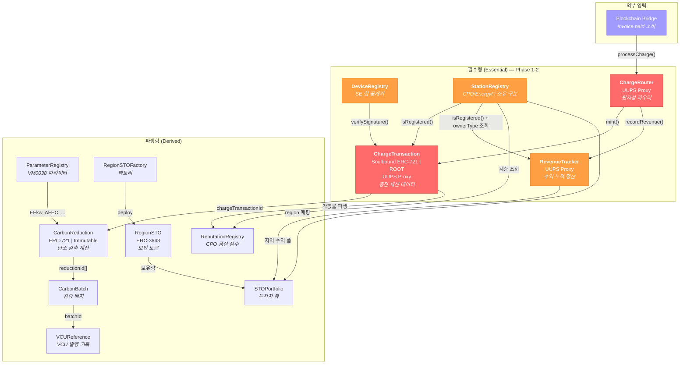

# Phase별 스마트 컨트랙트 구현 로드맵

## EV 충전 인프라 STO 프로젝트 — ChargeTransaction 중심 구현 전략

2026.03.03 | Ver 3.0 | 기밀

---

## 목차

1. [이중 서명 신뢰 모델](#1-이중-서명-신뢰-모델)
2. [컨트랙트 분류: 필수형 vs 파생형](#2-컨트랙트-분류-필수형-vs-파생형)
3. [ChargeTransaction 중심 의존성 그래프](#3-chargetransaction-중심-의존성-그래프)
4. [Phase별 구현 계획](#4-phase별-구현-계획)
5. [Phase 요약 테이블](#5-phase-요약-테이블)
6. [확정 정책 참조 (P1~P5)](#6-확정-정책-참조-p1p5)
7. [리스크 및 대응](#7-리스크-및-대응)

---

## 1. 이중 서명 신뢰 모델

온체인에 기록되는 충전 데이터의 신뢰는 **두 개의 서명 레이어**에 의해 보장됩니다. 각 레이어는 독립적으로 진화하며, Phase에 따라 신뢰 수준이 점진적으로 강화됩니다.

### 1.1 서명 레이어 구조

| 레이어 | 서명 주체 | 키 관리 | 서명 대상 | 온체인 저장 위치 | 검증 방법 | 보장 내용 |
|--------|----------|--------|----------|----------------|----------|----------|
| **Layer 1: HW/임베디드** | TPM 2.0 SE 칩 (회사 지정 모델) | 칩 내부 (추출 불가) | 원시 계측 데이터 (kWh, timestamps) | `ChargeSession.seSignature` 필드 | `ecrecover` 또는 P-256 precompile | 물리적 측정값의 출처 증명 — 데이터가 특정 물리 장치에서 특정 시점에 생성되었음을 암호학적으로 보장 |
| **Layer 2: 플랫폼** | Blockchain Bridge 지갑 | AWS KMS (HSM 기반, 평문 키 미노출) | `ChargeRouter.processCharge()` 트랜잭션 전체 | Ethereum TX 자체의 (v, r, s) | `onlyBridge` modifier (`msg.sender` 검증) | 플랫폼 파이프라인 무결성 — 결제 완료(P1)된 건만 DERA 검증을 통과하여 온체인에 기록됨을 보장 |

### 1.2 Phase별 신뢰 모델 진화

> **설계 변경 (2026.03)**: 플랫폼과 충전기는 동시에 런칭한다. 따라서 Phase 1부터 실제 SE 칩이 장착되고 seSignature는 실제 값이다. 기존 "Phase 1: seSignature = 0x" 가정은 폐기된다.

| Phase | 시점 | Layer 1 (HW) | Layer 2 (플랫폼) | 신뢰 근거 |
|-------|------|-------------|-----------------|----------|
| **Phase 1 완료** | 2026.04 | ✅ DeviceRegistry 배포, SE 칩 공개키 사전 등록 | — (ChargeTransaction 미배포) | 온체인 등록 준비 단계. mint() 호출 전 상태. |
| **Phase 2 완료 (런칭)** | 2026.06~ | ✅ SE 서명 실제 값 + DeviceRegistry 온체인 검증 활성 | ✅ `onlyBridge` + 결제 완료 게이트(P1) | Bookend 신뢰 모델 완전 가동. DeviceRegistry 등록 공개키로 SE 서명 즉시 검증. |
| **Phase 3 (STO 활성화)** | 2027.01~ | ✅ 동일 | ✅ 동일 | STO 토큰 활성화. 동일한 하드웨어 신뢰 모델 유지. |
| **Phase 4 이후** | 2027 H2~ | ✅ 동일 (성능 최적화 가능) | ✅ 동일 | precompile 교체 등 성능 개선. 신뢰 모델 변경 없음. |

**신뢰 모델 데이터 흐름:**
```
충전기(SE 칩) → SE 서명 생성 → Gateway → 결제 → invoice.paid
  → Blockchain Bridge [Layer 2 서명: Bridge 지갑이 TX 서명]
    → ChargeRouter.processCharge() [onlyBridge 검증]
      → ChargeTransaction.mint() — DeviceRegistry.verifySignature() [SE 서명 검증]
      → RevenueTracker.recordRevenue() — 수익 누적
```

### 1.3 데이터 흐름과 서명 지점

```
Phase 1-2 완료 후 (런칭부터 적용):
  충전기(OCPP + SE 칩) → SE 칩 [Layer 1 서명: 원시 데이터 서명] → Gateway → 결제 → invoice.paid
    → Blockchain Bridge [Layer 2 서명: Bridge 지갑이 TX 서명]
        → ChargeRouter.processCharge(session, period_yyyyMM)  [onlyBridge 검증]
            → 1. ChargeTransaction.mint(session)
                   → DeviceRegistry.verifySignature(chargerId, msgHash, seSignature)
                     → P-256 precompile(0x100) 검증 통과 → ChargeSession 기록 (Soulbound ERC-721)
                   → StationRegistry.isRegistered(stationId) 검증 → 미등록 시 revert
            → 2. RevenueTracker.recordRevenue(stationId, distributableKrw, period_yyyyMM)
                   → StationRegistry.isRegistered(stationId) 검증
                   → require(distributableKrw > 0)
                   → stationAccumulated 업데이트 + monthlyHistory 업데이트
            → 원자성 보장: 1 또는 2 실패 시 전체 revert
```

### 1.4 Bookend 검증 모델 — 양 끝 서명으로 전체 경로 무결성 보장

두 서명은 데이터 경로의 **양 끝(bookend)**을 잡습니다. 중간 레이어 각각에 별도 서명을 넣지 않아도, 양 끝의 서명 데이터가 일치하면 전체 경로의 무결성이 보장됩니다.

```
[Layer 1: SE 서명]                                         [Layer 2: Bridge 서명]
      │                                                            │
  물리 측정                    중간 레이어                          온체인 기록
      │                          │                                 │
  SE 칩이 kWh,                  Gateway                       AWS KMS가 TX
  timestamps에            → 결제 → invoice.paid                 서명 후 제출
  서명 생성                                                  (onlyBridge 검증)
      │                                                            │
      └──── SE 서명 원본 데이터 vs 온체인 ChargeSession 비교 ────┘
                    일치 → 중간 경로 전체 무결성 증명
```

**VVB 감사관 검증 절차:**

| 검증 단계 | 질문 | 검증 수단 |
|----------|------|----------|
| 1 | 이 데이터가 실제 물리 장치에서 나왔는가? | SE 서명 검증 (`seSignature` → SE 공개키로 복원) |
| 2 | 인가된 플랫폼이 제출했는가? | Bridge TX 서명 검증 (TX의 `from` == `bridgeAddress`) |
| 3 | 중간에 변조되지 않았는가? | SE 서명 원본 데이터 vs 온체인 `ChargeSession` 데이터 비교 |

3단계에서 일치가 확인되면, 중간 경로(Gateway, 결제, Bridge)에서 데이터가 변조되지 않았음이 자동으로 증명됩니다.

### 1.5 AWS KMS 기반 Bridge 키 관리

Bridge 지갑의 private key는 AWS KMS의 HSM(Hardware Security Module) 내부에서만 존재합니다. 평문 키가 서버 메모리에 올라가지 않으며, `eth_sendRawTransaction` 시점에 KMS API 호출로 서명만 수신하는 구조입니다.

| 항목 | 내용 |
|------|------|
| **키 저장** | AWS KMS HSM (FIPS 140-2 Level 3) |
| **서명 방식** | KMS `Sign` API 호출 → ECDSA secp256k1 서명 반환 |
| **키 노출** | 서버 메모리에 평문 키 미노출. KMS 외부 추출 불가. |
| **접근 제어** | IAM 정책으로 Bridge 서비스만 서명 권한 부여 |
| **감사 추적** | CloudTrail에 모든 서명 요청 로깅 |
| **리스크 완화** | Bridge가 단일 hot wallet이라는 리스크를 HSM 수준 키 보호로 상쇄 |

---

## 2. 컨트랙트 분류: 필수형 vs 파생형

12개 스마트 컨트랙트(+ RegionSTOFactory + ChargeRouter)를 **데이터 생산/소비 관계**에 따라 두 범주로 분류합니다. 이 분류가 구현 우선순위의 근거입니다.

### 2.1 분류 기준

- **필수형 (Essential)**: Phase 1-2 핵심 데이터 파이프라인을 구성하는 컨트랙트. 이들이 없으면 시스템이 동작하지 않음.
- **파생형 (Derived)**: 필수형이 생산한 데이터를 소비·집계·변환하는 컨트랙트. 필수형에 의존하지만 역방향 의존성은 없음.

### 2.2 필수형 컨트랙트 (Essential) — 5개

| # | 컨트랙트 | 역할 | 분류 근거 |
|---|---------|------|----------|
| 0 | **DeviceRegistry** | 🔒 SE 칩 공개키 저장소 | ChargeTransaction이 `verifySignature()`를 직접 호출. 없으면 SE 서명 검증 불가. Phase 1 즉시 배포. |
| 1 | **StationRegistry** | 🏗️ 충전소 계층 + 소유자 유형 | ownerType(CPO/ENERGYFI) 조회 없이 수익 귀속 불가. RevenueTracker의 필수 참조 대상. Phase 1 배포. |
| 2 | **ChargeTransaction** | 🔴 ROOT — 전체 시스템의 데이터 소스 | 모든 하위 컨트랙트의 원천 데이터 생산. Soulbound ERC-721, 충전 세션당 1 토큰 (non-transferable, `address(this)` 귀속). `invoice.paid` → Bridge → ChargeRouter → `mint()` 경로로 데이터 유입. UUPS Proxy. |
| 3 | **RevenueTracker** | 💰 수익 누적·정산 추적 | ChargeRouter.processCharge() 내에서 mint() 직후 연속 호출. CPO 수익 / EnergyFi 지역 수익 풀 실시간 집계. STOPortfolio의 필수 데이터 소스. UUPS Proxy. |
| — | **ChargeRouter** | 🔗 원자성 라우터 | ChargeTransaction.mint() + RevenueTracker.recordRevenue()를 단일 트랜잭션으로 원자적 실행. Bridge는 이 컨트랙트만 호출. 하나라도 실패 시 전체 revert. UUPS Proxy. |

> **의존성 체인**: DeviceRegistry ← ChargeTransaction ←── **ChargeRouter** ──→ RevenueTracker [StationRegistry 참조]

### 2.3 파생형 컨트랙트 (Derived) — 8개

| # | 컨트랙트 | 소비하는 데이터 | 분류 근거 |
|---|---------|---------------|----------|
| 4 | **CarbonReduction** | ChargeTransaction + ParameterRegistry | Phase 4 탄소 파이프라인. VM0038 수식 적용. Immutable 배포. |
| 5 | **ParameterRegistry** | N/A (독립 파라미터 저장소) | CarbonReduction의 필수 의존성이나 Phase 4까지 불필요. |
| 6 | **CarbonBatch** | CarbonReduction 토큰 ID 목록 | VVB 검증 주기에 맞춰 배치 관리. |
| 7 | **VCUReference** | CarbonBatch ID | Verra VCU 발행 결과 온체인 기록. |
| 8 | **ReputationRegistry** | ChargeTransaction (가동률 등 파생 지표) | Oracle 패턴. Phase 3 선택사항. |
| 9 | **RegionSTO** | N/A (ERC-3643 토큰 컨트랙트 — RevenueTracker 직접 의존 없음. STOPortfolio가 RevenueTracker 조회) | ERC-3643 보안 토큰. 전자증권법 시행 후 활성화. |
| — | **RegionSTOFactory** | N/A (팩토리) | RegionSTO 인스턴스 배포 전용. |
| 10 | **STOPortfolio** | RevenueTracker, RegionSTO, StationRegistry | 투자자 포트폴리오 집계 뷰. |

### 2.4 필수형/파생형 판별 흐름

```
Q: 이 컨트랙트가 없으면 Phase 1-2 데이터 파이프라인이 중단되는가?
  YES → 필수형
  NO  → Q: 이 컨트랙트가 필수형 데이터를 소비하는가?
          YES → 파생형
          NO  → 독립 유틸리티 (현재 아키텍처에 해당 없음)
```

---

## 3. ChargeTransaction 중심 의존성 그래프

ChargeTransaction이 전체 시스템의 중심임을 시각화합니다. 화살표 방향은 **데이터 흐름 방향** (데이터 소스 → 데이터 소비자)입니다.



### 의존성 요약

| 컨트랙트 | 의존 대상 | 의존 방향 |
|---------|----------|----------|
| ChargeRouter | ChargeTransaction, RevenueTracker | ← 라우팅 대상 |
| ChargeTransaction | DeviceRegistry, StationRegistry | ← 필수 의존 |
| RevenueTracker | StationRegistry | ← 필수 의존 |
| CarbonReduction | ChargeTransaction, ParameterRegistry | ← 필수 의존 |
| CarbonBatch | CarbonReduction | ← 필수 의존 |
| VCUReference | CarbonBatch | ← 필수 의존 |
| ReputationRegistry | ChargeTransaction, StationRegistry | ← 데이터 소비 |
| STOPortfolio | RevenueTracker, RegionSTO, StationRegistry | ← 집계 뷰 |

---

## 4. Phase별 구현 계획

---

### Phase 1: DeviceRegistry + StationRegistry (충전 인프라 등록)

**목표**: 충전기 SE 칩 공개키 등록, CPO·충전소·충전기 계층 구조 온체인 확립.

| 항목 | 내용 |
|------|------|
| **컨트랙트** | DeviceRegistry (선행 배포) + StationRegistry |
| **타임라인** | 즉시 착수 ~ 2026.04 |
| **온체인 의존성** | StationRegistry: 없음 / DeviceRegistry: 없음 |

**핵심 설계 결정:**

1. **DeviceRegistry 먼저 배포**: Phase 2에서 ChargeTransaction 배포 시 DeviceRegistry 주소를 initialize()에 전달하여 바인딩. SE 칩 공개키는 충전기 출하 전에 사전 등록.

2. **StationRegistry ownerType 필드**: 각 충전소에 `OwnerType.CPO` 또는 `OwnerType.ENERGYFI`를 부여. 이 값이 Phase 2 수익 귀속의 근거가 됨.

3. **CPO 구조**:
   - EnergyFi가 CPO에게 충전기+소프트웨어 솔루션 판매 → CPO 소유 충전소는 ownerType = CPO
   - EnergyFi 직접 소유 충전소는 ownerType = ENERGYFI (CPO 불필요 또는 EnergyFi 자체가 CPO)

4. **수익 귀속 규칙 (간단 이분)**:
   ```
   CPO 소유 충전소    → distributableKrw 100% → CPO (STO 무관)
   EnergyFi 소유 충전소 → distributableKrw 100% → 해당 지역 STO 투자자 풀
   ```

**함수 명세 및 Mock Oracle 상세**: [Phase 1 스펙](phase1-infra-spec.md)

**대시보드**: 지역별 인프라 현황 / CPO별 현황 / SE 칩 등록 현황

**통합 테스트 (2026.03 완료):**
- [x] CPO 등록 후 조회
- [x] EnergyFi 소유 충전소 `getEnergyFiStationsByRegion()` 검증
- [x] `isEnergyFiOwned()` 정확성 검증
- [x] 권한 없는 주소의 등록 시도 → revert 확인
- [x] 전체 47개 테스트 통과 (StationRegistry 28 + DeviceRegistry 19, P-256 1건 skip)

---

### Phase 2: ChargeTransaction + RevenueTracker + ChargeRouter (충전 트랜잭션 + 수익 추적)

**목표**: 결제 완료 시 충전 데이터 온체인 기록. 충전소 소유자에게 누적 수익 실시간 조회. ChargeRouter로 mint + recordRevenue 원자성 보장.

| 항목 | 내용 |
|------|------|
| **컨트랙트** | ChargeTransaction, RevenueTracker, ChargeRouter (신규) |
| **토큰 표준** | ChargeTransaction: Soulbound ERC-721 (non-transferable, `address(this)` 귀속) |
| **Upgradeability** | UUPS Proxy (OpenZeppelin UUPSUpgradeable) — 3개 컨트랙트 모두 |
| **타임라인** | 2026.04 ~ 06 |
| **온체인 의존성** | ChargeTransaction → DeviceRegistry (SE 서명 검증) + StationRegistry (stationId 검증) / RevenueTracker → StationRegistry (ownerType 조회 + stationId 검증) / ChargeRouter → ChargeTransaction + RevenueTracker |

**확정 설계 결정 (10건):**

| # | 항목 | 결정 |
|:--|:--|:--|
| 1 | ERC-721 토큰 수신자 | **Soulbound** (non-transferable, 컨트랙트 자체에 귀속) |
| 2 | SE 서명 임시 처리 | **Mock 서명** (테스트 키로 전체 플로우 검증, bypass 없음) |
| 3 | UUID → bytes32 인코딩 | **접두사 제거 + 하이픈 제거 → hex bytes32** (결정적, 역변환 가능) |
| 4 | Oracle/대시보드 스택 | **Hardhat script (Oracle) + 간단한 웹 대시보드 (HTML+ethers.js)** |
| 5 | period_yyyyMM 계산 | **Bridge가 오프체인 계산 후 파라미터로 전달** |
| 6 | Upgradeability | **UUPS Proxy** (OpenZeppelin UUPSUpgradeable) |
| 7 | 원자성 보장 | **ChargeRouter 컨트랙트** (mint + recordRevenue 단일 함수) |
| 8 | stationId 검증 | **Revert** (미등록 stationId → 무조건 revert) |
| 9 | 대시보드 범위 | **7개 화면** (기존 4 + 정산 이력 + 지역 수익 + 세션 상세) |
| 10 | Setup 데이터 규모 | **포괄적** (CPO 2 + 충전소 5 + 충전기 10 + SE칩 10 + 3개 지역) |

**핵심 설계:**

1. **ChargeRouter — 원자성 라우터**: Bridge는 `ChargeRouter.processCharge(session, period_yyyyMM)` 단일 함수만 호출. 내부에서 `ChargeTransaction.mint(session)` + `RevenueTracker.recordRevenue(stationId, distributableKrw, period_yyyyMM)` 순차 실행. 하나라도 실패 시 전체 revert.

2. **bridgeAddress 설정 구조**:
   ```
   AWS KMS Bridge 지갑 → ChargeRouter.processCharge()
                             ├─→ ChargeTransaction.mint(session)
                             └─→ RevenueTracker.recordRevenue(stationId, distributableKrw, period)

   bridgeAddress 설정:
     ChargeRouter.bridgeAddress     = AWS KMS Bridge 지갑 주소
     ChargeTransaction.bridgeAddress = ChargeRouter 컨트랙트 주소
     RevenueTracker.bridgeAddress   = ChargeRouter 컨트랙트 주소
   ```

3. **Soulbound ERC-721**: `_update()` override로 mint 이후 전송 차단. `mint()` 시 `to = address(this)`. `transfer()`/`transferFrom()` 호출 시 `SoulboundToken` revert.

4. **UUPS Proxy 패턴**: 3개 컨트랙트 모두 `initialize()` 함수 사용 (생성자 대체). `_authorizeUpgrade()` override — `onlyRole(DEFAULT_ADMIN_ROLE)` 권한 검증.

5. **sessionId 중복 방지**: `mapping(bytes32 => uint256) _sessionToToken`. 동일 sessionId 중복 mint() 시 `DuplicateSession` revert.

6. **stationId 유효성 검증**: ChargeTransaction.mint()와 RevenueTracker.recordRevenue() 모두 `StationRegistry.isRegistered(stationId)` 확인. 미등록 시 `StationNotRegistered` revert.

7. **UUID → bytes32 인코딩**: 접두사 제거 → 하이픈 제거 → hex → bytes32 (상위 16바이트 + 하위 zero-padding). Bridge가 오프체인에서 변환. 역변환 가능.

8. **SE 서명 Mock 모드**: DeviceRegistry에 P-256 테스트 키페어 등록. Oracle이 동일 프라이빗 키로 서명 생성. `verifySignature()` 호출 항상 수행 (bypass 없음). 운영 환경과 동일 코드 경로.

9. **`invoice.paid` 페이로드 → `ChargeSession` struct 매핑**:

```
invoice.paid 페이로드                         →  ChargeSession struct
────────────────────────────────────────────────────────────────────────────────
charging.energy_delivered_kwh                →  energyKwh (uint256, ×100 스케일링)
charging.charging_started_at                 →  startTimestamp (uint256, Unix)
charging.charging_stopped_at                 →  endTimestamp (uint256, Unix)
charger_id (UUID)                            →  chargerId (bytes32)
station_id (UUID)                            →  stationId (bytes32)
region_id (ISO 3166-2:KR) [탄소 EFkw 전용]  →  gridRegionCode (bytes4)
cpo_id (UUID)                                →  cpoId (bytes32)
session_id (UUID) [invoice_id와 1:1 대응]    →  sessionId (bytes32, 멱등성 키)
StationRegistry.getCharger(chargerId) 온체인  →  chargerType (uint8)
(현재 UNKNOWN(0) 고정. OCPP 2.0.1 전환 시)  →  vehicleCategory (uint8)
distributable_krw (STRIKON 정산)             →  distributableKrw (uint256)
se_signature (STRIKON 추가 예정 — Phase 2    →  seSignature (bytes)
  착수 전 확인 필수. 현재 미제공.)
(Bridge 오프체인 계산)                        →  period_yyyyMM (ChargeRouter 파라미터)
```

10. **데이터 변환 책임**: Bridge가 모든 변환 수행 (kWh→uint256, ISO 8601→Unix, UUID→bytes32, region_id→bytes4, timestamp→period_yyyyMM). 컨트랙트는 변환된 값을 그대로 저장.

**배포 순서**:
```
1. ChargeTransaction Implementation 배포
2. ChargeTransaction Proxy 배포 (ERC1967Proxy)
3. RevenueTracker Implementation 배포
4. RevenueTracker Proxy 배포 (ERC1967Proxy)
5. ChargeRouter Implementation 배포
6. ChargeRouter Proxy 배포 (ERC1967Proxy)
7. ChargeTransaction.initialize(deviceRegistry, stationRegistry, chargeRouterProxy, admin)
8. RevenueTracker.initialize(stationRegistry, chargeRouterProxy, admin)
9. ChargeRouter.initialize(chargeTransactionProxy, revenueTrackerProxy, bridgeWallet, admin)
```

> **bridgeAddress 설정 주의**: ChargeTransaction과 RevenueTracker의 bridgeAddress = **ChargeRouter Proxy 주소**. ChargeRouter의 bridgeAddress = **AWS KMS Bridge 지갑 주소**.

**함수 명세, Struct, 이벤트, Mock Oracle 상세, 대시보드 (7개 화면), 통합 테스트 체크리스트**: [Phase 2 스펙](phase2-transaction-spec.md)

**Mock Oracle**: 10개 메뉴 (모의 세션 발생 / 대량 세션 / CPO 월정산 / 충전소별 수익 / EnergyFi 지역 수익 / 세션 상세 / 정산 이력 / 실패 시나리오 테스트 / 월경계 테스트 / ERC-721 정보)

**대시보드**: 7개 화면 (실시간 충전 피드 / 충전소별 수익 / CPO 수익 통계 / 월별 통계 / 정산 이력 / EnergyFi 지역 수익 / 세션 상세 조회)

**통합 테스트:**
- [ ] ChargeTransaction: SE 서명 포함 세션 mint() 성공, 서명 실패 revert, 미등록 chargerId revert, 중복 sessionId revert, 미등록 stationId revert
- [ ] ChargeTransaction: Soulbound 검증 (transfer/transferFrom revert), tokenURI 빈 문자열, UUPS upgrade 권한
- [ ] RevenueTracker: 모의 세션 100건 후 stationAccumulated 정확성, CPO/EnergyFi 수익 분리, claim() 후 pending=0, ZeroAmount revert, 미등록 stationId revert, UUPS upgrade 권한
- [ ] ChargeRouter: processCharge() 성공, mint 실패 시 전체 revert (원자성), recordRevenue 실패 시 전체 revert (원자성), onlyBridge 권한
- [ ] ChargeRouter 경유 연동: processCharge() 후 CT 토큰 + RT 수익 동시 확인, 100건 대량 처리 정합성

---

### Phase 3: RegionSTO + RegionSTOFactory + STOPortfolio (STO 발행)

**목표**: 전자증권법 시행에 맞춰 EnergyFi 소유 충전소 기반 지역별 STO 차수 발행.

| 항목 | 내용 |
|------|------|
| **타임라인** | 2027.01~ (전자증권법 시행) |
| **전제 조건** | Phase 1-2 완료 및 데이터 축적 (2026.06~12 약 6개월) |

**비즈니스 제약:**
- EnergyFi 소유 충전소만 STO 참여. CPO 소유 충전소 미참여.
- 발행 단위: 지역 (17개 광역자치단체, ISO 3166-2:KR)
- 발행 방식: 차수(Tranche) — 일정 충전소 추가 시 묶어서 일괄 발행

**RegionSTO (발행 경로 미결정 — 구현 보류):**
- 세 경로 모두 법적으로 가능. CCIP Path(EnergyFi L1 → CCIP → KSD 지원 체인, 권장) / Path A(EnergyFi = 발행인계좌관리기관, EnergyFi L1에 직접 발행 + KSD 노드 참여) / Path B(증권사 위탁 발행, EnergyFi L1에 토큰 없음).
- 대통령령 세부 요건 확정 + KSD 체인 확정 후 경로 결정. Phase 2 RevenueTracker가 어느 경로든 데이터 기반.
- KSD는 단일 체인을 운영하지 않음. 각 발행인 원장에 노드로 참여. Avalanche L1 선택은 유효.

**Phase 3 EnergyFi L1 신규 컨트랙트: CCIPRevenueSender**
- RevenueTracker 데이터를 Revenue Attestation 메시지로 포맷 (regionId, periodStart/End, distributableKrw, merkleRoot, stationCount)
- CCIP Router를 통해 KSD 지원 체인 (Hyperledger Besu 등)으로 전송
- 차수 발행 주기마다 Bridge가 `onlyBridge` 패턴으로 호출
- KSD 지원 체인 확정 후 구현 착수 (현재 보류)

**함수 명세, Struct, ERC-3643 인터페이스 상세**: [Phase 3 스펙](phase3-sto-spec.md)

**STO 차수 발행 흐름:**

```
1. EnergyFi 신규 충전소 n개 설치 완료
2. 투자자 모집 및 KYC (오프체인)
3. RegionSTOFactory.deployRegionSTO() — 처음인 경우
4. RegionSTO.addToWhitelist(investors[])
5. RegionSTO.issueNewTranche(tranche, investors, amounts)
6. 대시보드에서 차수 발행 기록 확인
```

**발행인-증권사 역할 분리:**

| 역할 | 주체 | 온체인 범위 |
|------|------|-----------|
| 토큰 발행 (차수 민팅) | 발행인 (회사) | `RegionSTO.issueNewTranche()` |
| 수익 데이터 기록 | 발행인 (회사) | RevenueTracker (ChargeRouter → Bridge 호출) |
| KYC/AML, 투자자 적격성 | 증권사 | IdentityRegistry 운영 |
| 배당 계산·집행 | 증권사 | off-chain (온체인 수익 데이터 참조) |
| 문서 관리 | 증권사 | off-chain |

> ~~ERC-2222~~ (배당), ~~ERC-1643~~ (문서 관리) 제외 — 증권사 영역.

**Mock Oracle 및 통합 테스트 상세**: [Phase 3 스펙](phase3-sto-spec.md)

**통합 테스트:**
- [ ] RegionSTOFactory로 RegionSTO 2개 이상 배포 확인
- [ ] 1차 차수 발행 → 투자자 잔액 확인
- [ ] 2차 차수 발행 → 기존 투자자 잔액 유지 + 신규 합산
- [ ] STOPortfolio.getRegionPoolRevenue() — RevenueTracker 연동 확인
- [ ] whitelist 미등록 주소 transfer() → revert 확인

---

### Phase 4: ParameterRegistry + CarbonReduction + CarbonBatch + VCUReference (탄소배출권)

**목표**: VM0038 방법론 기반 탄소 감축 기록. VVB 검증 및 Verra VCU 발행 온체인 연결.

| 항목 | 내용 |
|------|------|
| **타임라인** | VVB 검증 개시 시점 (2027 이후) |
| **전제 조건** | Phase 2 ChargeTransaction 레코드 충분히 축적 |

**ParameterRegistry**: VM0038 파라미터(EFkw, EFfuel, AFEC, DCFC_EFF, EV_EFF) 버전 관리 저장소.

**CarbonReduction** (Immutable 배포): ChargeTransaction 데이터 + ParameterRegistry 파라미터로 VM0038 수식 적용.

```
Net Reduction = Baseline Emissions − Project Emissions
  Baseline = EC × (AFEC⁻¹) × EFfuel    (ICE 차량 동등 배출)
  Project  = EC × EFkw × (chargerType == DCFC ? 1/0.923 : 1)
  Leakage  = 0    (VM0038/AMS-III.C 기준)
```

**CarbonBatch**: VVB 검증 주기에 맞춰 CarbonReduction 레코드 배치 관리. 상태 전이: `OPEN → LOCKED → VERIFIED` (비가역).

**VCUReference** (Append-only): Verra VCU 발행 결과 온체인 기록. CarbonBatch와 1:1 연결.

**Mock Oracle 및 통합 테스트 상세**: [Phase 4 스펙](phase4-carbon-spec.md)

**통합 테스트:**
- [ ] ParameterRegistry 시점별 파라미터 조회 정확성 (VVB 감사 시뮬레이션)
- [ ] CarbonReduction 수식 검증 (known input → expected output)
- [ ] CarbonBatch 잠금 후 추가 불가 확인 (비가역성)
- [ ] VCUReference → CarbonBatch 1:1 연결 확인
- [ ] 동일 reductionId 중복 배치 불가 확인

---

## 5. Phase 요약 테이블

| Phase | 컨트랙트 | 분류 | Upgradeability | 타임라인 | 핵심 트리거 |
|-------|---------|------|----------------|---------|-----------|
| **1 ✅** | DeviceRegistry, StationRegistry | 필수형 | Upgradeable | 완료 | 구현·테스트 완료. |
| **2 ✅** | ChargeTransaction, RevenueTracker, ChargeRouter | 필수형 | UUPS Proxy | 완료 | 구현·통합 테스트 스위트 완료 (`npm run test:live`). |
| **3** | CCIPRevenueSender [EnergyFi L1 신규] / RegionSTO·Factory·Portfolio [KSD 체인, 보류] / ReputationRegistry(선택) | 파생형 | 미정 | 2027.01~ | 전자증권법 시행 |
| **4** | ParameterRegistry, CarbonReduction, CarbonBatch, VCUReference | 파생형 | CarbonReduction: Non-upgradeable / 나머지: Upgradeable | VVB 검증 개시~ | VVB 검증 개시 |

### 전체 12+2 컨트랙트 배정 검증

| # | 컨트랙트 | Phase | 분류 | Upgradeability | ✅ |
|---|---------|-------|------|----------------|---|
| 0 | DeviceRegistry | 1 | 필수형 | Upgradeable | ✅ |
| 1 | StationRegistry | 1 | 필수형 | Upgradeable | ✅ |
| 2 | ChargeTransaction | 2 | 필수형 | UUPS Proxy | ✅ |
| 3 | RevenueTracker | 2 | 필수형 | UUPS Proxy | ✅ |
| — | ChargeRouter | 2 | 필수형 | UUPS Proxy | ✅ |
| 4 | CarbonReduction | 4 | 파생형 | **Non-upgradeable** | ✅ |
| 5 | ParameterRegistry | 4 | 파생형 | Upgradeable | ✅ |
| 6 | CarbonBatch | 4 | 파생형 | Upgradeable | ✅ |
| 7 | VCUReference | 4 | 파생형 | Upgradeable | ✅ |
| 3.5 | CCIPRevenueSender | 3 | 파생형 | Non-upgradeable | ✅ |
| 8 | ReputationRegistry | 3 (선택) | 파생형 | Upgradeable | ✅ |
| 9 | STOPortfolio | 3 | 파생형 | Upgradeable | ✅ |
| 10 | RegionSTO | 3 | 파생형 | 미확정 | ✅ |
| — | RegionSTOFactory | 3 | 파생형 | Upgradeable | ✅ |

---

## 6. 확정 정책 참조 (P1~P6)

아래 정책은 `docs/platform-policies.md`에서 확정되었으며, 각 Phase의 설계 결정에 직접 반영됩니다.

| # | 정책 | 적용 Phase | 설계 영향 |
|---|------|-----------|----------|
| **P1** | 결제 완료 건만 온체인 기록 | Phase 2 | `ChargeTransaction.mint()`는 `invoice.paid` 이벤트에서만 트리거. 결제 실패 건은 온체인에 기록되지 않음. VVB 감사 시 데이터 순도 보장. |
| **P2** | `invoice.paid` 시점에 통합 기록 | Phase 2, Phase 3 | `invoice.paid` → Bridge → `ChargeRouter.processCharge()` → `ChargeTransaction.mint()` + `RevenueTracker.recordRevenue()` 원자적 처리. |
| **P3** | RegionSTO 토큰 설계 보류 | Phase 3 | 발행 경로 미결정 (Path A: 직접 발행 / Path B: 증권사 위탁). 대통령령 세부 요건 확정 후 경로 선택. KSD는 발행인 원장에 노드로 참여하는 구조 — Avalanche L1 선택 유효. Phase 3 핵심 결과물 경로 확정 후 재정의. |
| **P4** | SE 서명은 Phase 1부터 (설계 변경) | Phase 1~ | Phase 1: DeviceRegistry 온체인 검증 활성. seSignature는 실제 SE 서명. |
| **P5** | ChargeTransaction → CarbonReduction은 온체인 내부 계산 | Phase 4 | CarbonReduction은 ChargeTransaction 데이터 + ParameterRegistry 파라미터만으로 VM0038 수식 적용. 외부 오라클 불필요. |
| **P6** | Phase 3 권장 발행 경로: CCIP Path | ⚠️ 권장 (경로 미확정) | EnergyFi L1(Avalanche) → Chainlink CCIP → KSD 지원 체인으로 Revenue Attestation 전달. 발행인계좌관리기관 자격 불필요. DTCC(Avalanche+Besu+CCIP, 2025) 실증. KSD 지원 체인 확정 후 CCIPRevenueSender 구현 착수. |

### 정책과 Phase의 교차 매핑

```
P1 (결제 완료만) ─────→ Phase 2: onlyBridge + invoice.paid 게이트
P2 (통합 기록)   ─────→ Phase 2: ChargeRouter.processCharge() → mint() + recordRevenue()
                         Phase 3: STO 활성화
P3 (ERC-3643)   ─────→ Phase 3: RegionSTO 구현
P4 (SE Phase 1) ─────→ Phase 1: DeviceRegistry 온체인 검증
P5 (내부 계산)   ─────→ Phase 4: CarbonReduction 구현
P6 (CCIP Path)  ─────→ Phase 3: CCIPRevenueSender 구현 (KSD 지원 체인 확정 후)
```

---

## 7. 리스크 및 대응

### 7.1 Phase 1-2 리스크

| 리스크 | 영향도 | 대응 |
|--------|-------|------|
| `invoice.paid` 페이로드에 `chargerType`, `vehicleCategory` 누락 | 🟡 High | `chargerType`: Bridge가 `StationRegistry.getCharger(chargerId)` 온체인 조회로 해결. `vehicleCategory`: OCPP 1.6 환경에서 현재 `UNKNOWN(0)` 고정. OCPP 2.0.1 전환 시 실제 값 사용. |
| ✅ ~~Bridge에서 `ChargeTransaction.mint()` + `RevenueTracker.recordRevenue()` 이중 호출 불가~~ | ~~🔴 Critical~~ | **해결됨**: ChargeRouter 컨트랙트가 단일 TX로 양쪽 호출 원자적 실행. Bridge는 ChargeRouter.processCharge()만 호출. |
| ✅ ~~UUID → bytes32 인코딩 규칙 미확정~~ | ~~🟡 High~~ | **해결됨**: 접두사 제거 + 하이픈 제거 → hex bytes32 (결정적, 역변환 가능). Bridge 오프체인 변환. |
| ✅ ~~StationRegistry ownerType 미등록 충전소에서 mint() 호출~~ | ~~🟡 High~~ | **해결됨**: ChargeTransaction.mint()와 RevenueTracker.recordRevenue() 모두 StationRegistry.isRegistered(stationId) 검증. 미등록 시 `StationNotRegistered` revert. |

### 7.2 Phase 3 리스크

| 리스크 | 영향도 | 대응 |
|--------|-------|------|
| 유통 시장(장외거래소) 파트너 미결정 | 🔴 Critical | KDX·NXT·루센트블록 3파전 중 인가 취득 기관 불확실. 장외거래소가 사용하는 KSD 체인 기술 스택이 CCIP Receiver 설계에 영향. 대응: 발행 경로 확정 + 경로에 맞는 거래소 접촉. |
| CCIP 연동 KSD 체인 미확정 | 🔴 Critical | CCIP Receiver를 배포할 KSD 지원 체인 (Hyperledger Besu 등)이 확정되어야 CCIPRevenueSender 구현 가능. 대응: KSD 기술 협의 착수 시 CCIP 지원 체인 확인 필수. DTCC 사례(Avalanche+Besu+CCIP, 2025)를 레퍼런스로 제시. |
| 발행인계좌관리기관 자격 미확인 | 🔴 Critical | EnergyFi가 발행인계좌관리기관으로 직접 등록 가능한지 금융위 인가 요건 미확인. 불가 시 CCIP Path(권장) 또는 Path B(증권사 위탁)로 전환 — CCIP Path에서는 발행인계좌관리기관 자격 불필요. 대응: 대통령령 확정 직후 법률 자문 필수. |
| 발행 경로 미결정으로 구현 방향 불확실 | 🔴 Critical | Path A(직접 발행, EnergyFi L1 토큰 + KSD 노드 참여) vs Path B(증권사 위탁, 데이터만 제공) — 대통령령 세부 요건 확정 전 구현 착수 불가. 대응: Phase 3 구현 보류. Phase 2 RevenueTracker 견고화로 어느 경로든 데이터 기반 즉시 대응. |
| 증권사 파트너십 지연 | 🔴 Critical | Path A·B 모두 증권사 역할 필요 (KYC/AML, 배당 집행). 대응: Phase 3 보류 유지. 대통령령 확정 + 경로 결정 후 즉시 착수. |
| 차수 발행 시 투자자 목록 온체인 처리 가스 한도 | 🟡 High | 프라이빗 체인(가스비 0)이나 block gas limit은 존재. 차수당 투자자 수 제한 설계 필요. Path A 확정 후 설계. |
| 대통령령 미확정으로 컴플라이언스 모듈 설계 불가 | 🟡 High | 보류 유지. 대통령령 확정 후 증권사와 협의. |

### 7.3 Phase 4 리스크

| 리스크 | 영향도 | 대응 |
|--------|-------|------|
| RIP-7212 precompile 활성화 | 🟡 High | SE 알고리즘은 P-256(secp256r1)으로 확정. `l1-config/genesis.json`에 RIP-7212(`address(0x100)`) 활성화 필요 — 별도 인간 승인 항목 (CLAUDE.md §5 §4). Phase 2 배포 전 완료 필수. |
| VVB 검증 주기 불확정 | 🟡 High | CarbonBatch는 시점에 독립적. VVB 일정 확정 후 `createBatch()` 호출 시점 결정. |

### 7.4 리스크 대응 우선순위

```
✅ Resolved (Phase 2 설계 확정으로 해결):
  1. Bridge의 이중 컨트랙트 호출 → ChargeRouter로 해결
  2. UUID → bytes32 인코딩 규칙 → 접두사 제거 + 하이픈 제거 → hex bytes32
  3. 미등록 stationId → StationRegistry.isRegistered() 검증 + revert

🟡 High (Phase 2 개발 중 병행 해결):
  4. invoice.paid 추가 필드 (chargerType, vehicleCategory)
  5. invoice.paid 페이로드 필드 목록 최종 확정

🟡 High (Phase 2 배포 전 해결):
  6. RIP-7212 precompile genesis.json 활성화 (별도 인간 승인)

🟢 Medium (Phase 3 전까지 해결):
  7. 증권사 파트너십 착수
```

---

## 참조 문서

| 문서 | 경로 | 참조 내용 |
|------|------|----------|
| Phase 1 스펙 | `contracts/docs/phase1-infra-spec.md` | DeviceRegistry + StationRegistry 상세 |
| Phase 2 스펙 | `contracts/docs/phase2-transaction-spec.md` | ChargeTransaction + RevenueTracker + ChargeRouter 상세 |
| Phase 3 스펙 | `contracts/docs/phase3-sto-spec.md` | STO 차수 발행 상세 |
| Phase 4 스펙 | `contracts/docs/phase4-carbon-spec.md` | 탄소배출권 파이프라인 상세 |
| T-REX Architecture | `contracts/docs/trex-architecture.md` | ERC-3643 구현 설계 |
| Interface Spec | `docs/strikon-interface-spec.md` | invoice.paid 페이로드, Bridge 아키텍처 |

---

*End of Document*
