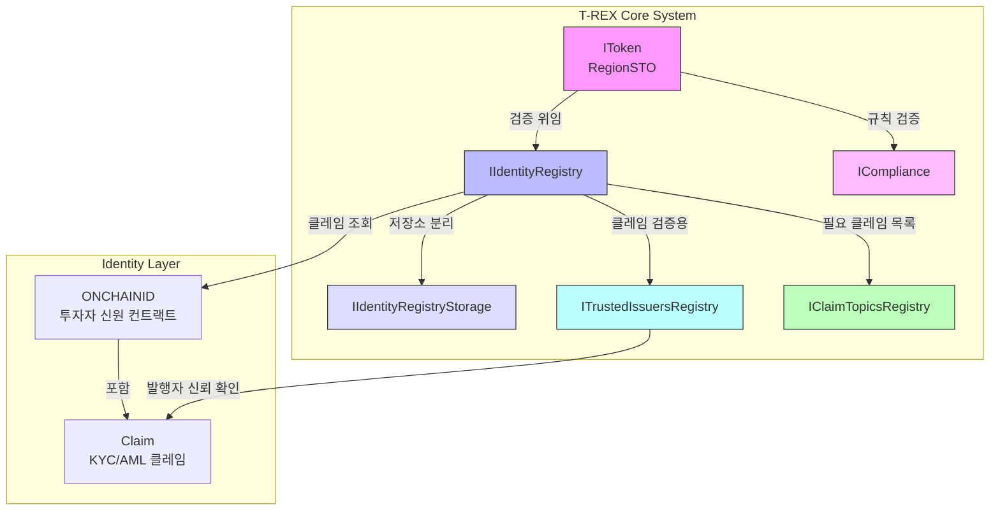
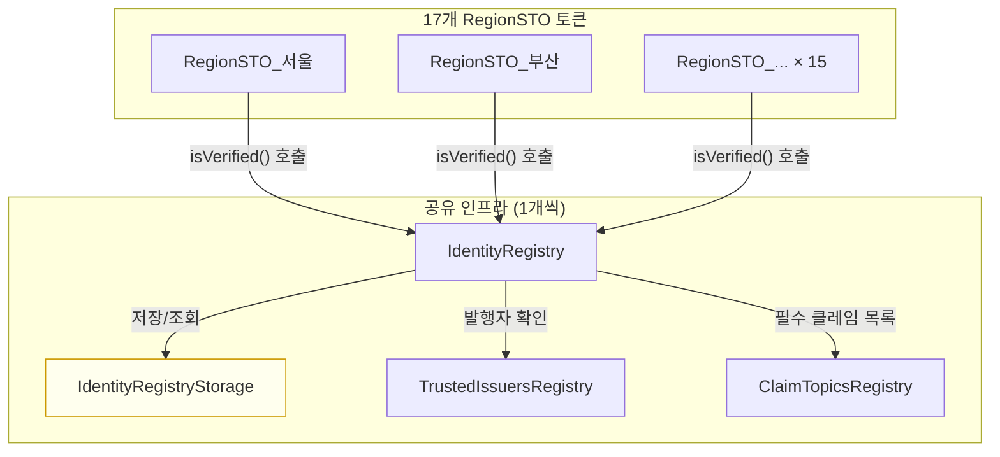

# T-REX (ERC-3643) 아키텍처 설계 문서

## EnergyFi — RegionSTO 구현을 위한 T-REX 프로토콜 적용 가이드

2026.03.02 | Ver 1.0 | 기밀

> **본 문서의 위치**: `erc-standards-analysis.md`가 "왜 ERC-3643인가"에 답한다면,
> 이 문서는 "ERC-3643을 EnergyFi에 어떻게 구현하는가"에 답한다.
> 두 문서는 상호 보완적이며, 이 문서는 spec-driven development의 출발점이다.

---

## 목차

1. [T-REX 프로토콜 아키텍처](#1-t-rex-프로토콜-아키텍처)
2. [EnergyFi 범위 경계 — 발행만, 유통 제외](#2-energyfi-범위-경계--발행만-유통-제외)
3. [ONCHAINID 투자자 신원 체계](#3-onchainid-투자자-신원-체계)
4. [Owner vs Agent 역할 매트릭스](#4-owner-vs-agent-역할-매트릭스)
5. [Claim Topics 설계 (한국 전자증권법 기반)](#5-claim-topics-설계-한국-전자증권법-기반)
6. [컴플라이언스 모듈 설계 (한국 전자증권법)](#6-컴플라이언스-모듈-설계-한국-전자증권법)
7. [IdentityRegistryStorage 공유 설계](#7-identityregistrystorage-공유-설계)
8. [TREXFactory로 RegionSTO 배포](#8-trexfactory로-regionstosorb-배포)
9. [EnergyFi 특화 적용](#9-energyfi-특화-적용)
10. [Phase별 구현 범위](#10-phase별-구현-범위)

---

## 1. T-REX 프로토콜 아키텍처

### 1.1 T-REX란 무엇인가

T-REX(Token for Regulated EXchanges)는 Tokeny Solutions가 개발하고 2023년 12월 Ethereum Final 표준으로 확정된 ERC-3643의 공식 구현 이름이다. 규제 증권의 토큰화를 위해 설계되었으며, ERC-20을 확장하되 **온체인 신원 관리, 모듈형 컴플라이언스, 허가형 전송**을 핵심 기능으로 추가한다.

일반 ERC-20 토큰이 "누구든 전송할 수 있다"라면, T-REX 토큰은 "KYC 완료 + 적격 투자자 조건 충족 + 컴플라이언스 규칙 통과한 경우에만 전송할 수 있다"는 보장을 온체인에서 강제한다.

### 1.2 6개 핵심 컨트랙트

T-REX 시스템은 단일 컨트랙트가 아니라 **6개 컨트랙트의 협력 시스템**으로 구성된다.

| # | 인터페이스 | 역할 | 개수 (EnergyFi) |
|:--|:--|:--|:--|
| 1 | `IToken` | ERC-20 확장 증권 토큰. 전송 전 compliance + identity 검증 | 17개 (지역구별 1개) |
| 2 | `IIdentityRegistry` | 투자자 지갑 ↔ ONCHAINID 매핑, 클레임 검증 수행 | 1개 (공유) |
| 3 | `IIdentityRegistryStorage` | IR의 영구 저장소. IR과 분리하여 업그레이드 가능 | 1개 (공유) |
| 4 | `ICompliance` | 전송 규칙 집합. 모듈 스왑으로 규칙 변경 | 1개 또는 지역별 |
| 5 | `ITrustedIssuersRegistry` | 신뢰할 수 있는 클레임 발행자(증권사) 등록 | 1개 (공유) |
| 6 | `IClaimTopicsRegistry` | 토큰 보유/전송에 필요한 클레임 종류 목록 | 1개 또는 지역별 |

### 1.3 컨트랙트 간 의존성 다이어그램



### 1.4 ERC-20을 어떻게 확장하는가

ERC-3643 `IToken`은 ERC-20의 `transfer()`와 `transferFrom()`을 **오버라이드**한다. 기존 ERC-20에서는 잔액만 확인하지만, T-REX에서는 전송 전에 추가 검증 레이어가 삽입된다.

```
ERC-20 transfer():
  잔액 확인 → 전송 실행

ERC-3643 transfer():
  잔액 확인
  → isVerified(from) 확인   // 송신자 KYC 검증
  → isVerified(to) 확인     // 수신자 KYC 검증
  → compliance.canTransfer() // 규칙 검증 (국가, 한도 등)
  → (모두 통과) 전송 실행
```

ERC-20과의 하위 호환성은 유지된다. ERC-20을 이해하는 지갑과 거래소는 RegionSTO 잔액을 정상적으로 읽을 수 있다. 단, 전송 시도 시 허가받지 않은 지갑은 revert된다.

---

## 2. EnergyFi 범위 경계 — 발행만, 유통 제외

### 2.1 핵심 원칙

**EnergyFi는 RegionSTO의 최초 발행(Initial Issuance)만 담당한다. 유통(Secondary Distribution)은 단 한 단계도 EnergyFi의 설계 범위에 포함되지 않는다.**

한국 전자증권법(2027.01 시행)상 발행인계좌관리기관과 장외거래중개업자(증권사)의 역할이 법적으로 분리되어 있으며, EnergyFi는 전자에 해당한다. 유통 관련 규칙 설계는 대통령령 확정 후 증권사 협의를 통해 결정된다.

### 2.2 발행 vs 유통 범위 구분

| 구분 | 내용 | 담당 |
|:--|:--|:--|
| **발행** | RegionSTO 컨트랙트 배포 | EnergyFi |
| **발행** | 투자자 ONCHAINID 등록 인프라 구축 | EnergyFi |
| **발행** | 투자자에게 최초 토큰 mint() | 증권사 (Agent 권한) |
| **발행** | 상환 시 토큰 burn() | 증권사 (Agent 권한) |
| ~~유통~~ | ~~투자자 간 전송 (canTransfer) 규칙 설계~~ | **증권사 전담 — EnergyFi 범위 외** |
| ~~유통~~ | ~~컴플라이언스 모듈 설계 (Country, Lockup 등)~~ | **증권사 전담 — EnergyFi 범위 외** |
| ~~유통~~ | ~~강제 전송, 동결, 복구 정책~~ | **증권사 전담 — EnergyFi 범위 외** |
| ~~유통~~ | ~~2차 시장 매매 규칙~~ | **증권사 전담 — EnergyFi 범위 외** |

### 2.3 ERC-3643 컴플라이언스 컨트랙트의 위치

ERC-3643은 토큰이 작동하려면 `ICompliance` 컨트랙트를 반드시 연결해야 한다. EnergyFi는 이 **인터페이스 껍데기(shell)를 배포**하되, 내부 모듈 구성(전송 규칙)은 전적으로 증권사가 설계·설정한다.

```
EnergyFi 책임:
  ICompliance 컨트랙트 배포 + 증권사를 Compliance Owner로 지정

증권사 책임:
  어떤 전송 규칙 모듈을 붙일 것인가 (대통령령 확정 후 결정)
```

유통 관련 컴플라이언스 모듈의 구체적 설계는 본 문서 범위 밖이다.

---

## 3. ONCHAINID 투자자 신원 체계

### 3.1 개요: ONCHAINID란

ONCHAINID는 T-REX 생태계에서 투자자의 **온체인 디지털 신원 컨트랙트**다. 각 투자자는 자신의 지갑 주소와 별개로 하나의 ONCHAINID 컨트랙트를 갖는다. 이 컨트랙트는 ERC-734(키 관리)와 ERC-735(클레임)를 구현한다.

```
투자자 지갑 (EOA): 0xABCD...
      ↓  매핑 (IdentityRegistry에 등록)
ONCHAINID 컨트랙트: 0x1234...
      ├── ERC-734: 키 목록 (지갑 주소들)
      └── ERC-735: 클레임 목록
              ├── Claim(topic=1, data=..., issuer=증권사A)   // KYC
              ├── Claim(topic=3, data=410, issuer=증권사A)   // 국가코드(한국)
              └── Claim(topic=10001, data=..., issuer=증권사A) // 적격투자자
```

### 3.2 ERC-734 (Key Management) vs ERC-735 (Claims)

| 표준 | 역할 | EnergyFi에서의 의미 |
|:--|:--|:--|
| **ERC-734** | ONCHAINID를 제어하는 키(주소) 목록 관리 | 투자자의 지갑 주소들이 이 ONCHAINID를 소유함을 증명. 지갑 분실 시 새 지갑을 키에 추가 가능 |
| **ERC-735** | 제3자(증권사)가 발행한 클레임 저장 | 증권사가 "이 사람은 KYC 완료된 한국 적격투자자"임을 서명으로 증명하는 데이터 저장 |

ERC-734가 "이 ONCHAINID의 소유자가 누구인가"를 답하고, ERC-735가 "이 소유자는 어떤 속성을 가진 사람인가"를 답한다.

### 3.3 투자자가 ONCHAINID를 갖는 프로세스

```
1. 투자자 → 증권사 앱에서 회원가입 + KYC 서류 제출
2. 증권사 오프체인 심사 (신분증, 적격투자자 확인 등)
3. 심사 통과 시:
   a. 증권사가 투자자의 지갑 주소를 등록받음
   b. 증권사 시스템이 투자자용 ONCHAINID 컨트랙트 배포
      (또는 투자자가 직접 배포 후 주소 제출)
   c. 증권사가 해당 ONCHAINID에 KYC 클레임 발행 (서명 포함)
   d. 증권사가 IdentityRegistry에 (투자자지갑 → ONCHAINID) 매핑 등록
4. 이후 투자자는 KYC 검증이 필요한 모든 RegionSTO에서
   별도 KYC 없이 토큰 보유/전송 가능 (공유 IdentityRegistry 활용)
```

### 3.4 증권사가 KYC 클레임을 발행하는 프로세스

```solidity
// 증권사 운영 스크립트 (의사 코드)
// 1. 클레임 데이터 준비
bytes memory claimData = abi.encode(investorCountryCode, kycExpiryDate);
bytes32 claimId = keccak256(abi.encodePacked(topic, issuer));

// 2. 증권사 키로 서명
bytes memory signature = sign(
    keccak256(abi.encodePacked(topic, data, issuer, subject))
);

// 3. 투자자 ONCHAINID에 클레임 추가
// (증권사가 ONCHAINID에 Management Key로 등록되어 있어야 함)
IONCHAINID(investorIdentity).addClaim(
    topic,      // 1 = KYC
    1,          // scheme = ECDSA
    issuer,     // 증권사 주소
    signature,
    claimData,
    ""          // URI
);
```

### 3.5 클레임 검증 흐름

`IdentityRegistry.isVerified(addr)` 내부에서:

```
1. IRS.storedIdentity(addr)로 ONCHAINID 주소 조회
2. CTR.getClaimTopics()로 필수 클레임 목록 조회 → [1, 3, 10001]
3. 각 topic에 대해:
   a. ONCHAINID.getClaimIdsByTopic(topic) → claimIds[]
   b. ONCHAINID.getClaim(claimId) → (topic, scheme, issuer, sig, data, uri)
   c. TIR.isTrustedIssuer(issuer) && TIR.hasClaimTopic(issuer, topic) 확인
   d. 서명 유효성 검증 (issuer의 키로 서명되었는가)
   e. data 내 만료일 확인 (kycExpiryDate > block.timestamp)
4. 모든 topic 통과 시 isVerified = true
```

---

## 4. Owner vs Agent 역할 매트릭스

### 4.1 T-REX의 Owner-Agent 이중 역할 모델

T-REX는 **Owner**와 **Agent** 두 개의 권한 레이어를 분리한다.

- **Owner**: 토큰의 전략적 소유자. 컨트랙트 설정, 파라미터 변경, Agent 임명.
- **Agent**: Owner가 임명한 운영자. 일상적인 증권 수명주기 관리(mint, burn, freeze, recovery) 수행.

이 구조는 EnergyFi의 **발행인(EnergyFi) vs 증권사** 역할 경계와 자연스럽게 매핑된다.

### 4.2 함수별 역할 매트릭스 (발행 범위 한정)

EnergyFi 범위(발행)에 해당하는 함수만 기재한다. 유통 관련 함수(forcedTransfer, freeze, recovery, pause 등)는 증권사 전담이므로 본 문서에서 설계하지 않는다.

| 함수 | Owner | Agent | 비고 |
|:--|:--:|:--:|:--|
| `setCompliance()` | ✅ | ❌ | 컴플라이언스 컨트랙트 교체 |
| `setIdentityRegistry()` | ✅ | ❌ | IdentityRegistry 교체 |
| `addAgent()` / `removeAgent()` | ✅ | ❌ | 증권사 Agent 임명/해임 |
| `mint()` | ❌ | ✅ | 최초 발행 — 투자자에게 토큰 발행 |
| `burn()` | ❌ | ✅ | 상환 시 토큰 소각 |
| `registerIdentity()` | ❌ | ✅ (IR) | 투자자 신원 등록 (IR의 Agent) |
| `deleteIdentity()` | ❌ | ✅ (IR) | 투자자 신원 삭제 (IR의 Agent) |

> 유통 관련 함수(forcedTransfer, freeze/unfreeze, recoveryAddress, pause 등)는 증권사가 대통령령 확정 후 자체 설계한다. EnergyFi는 이 함수들의 존재를 인지하되 설계하지 않는다.

### 4.3 EnergyFi에서 각 역할의 구체적 주체

| T-REX 역할 | EnergyFi 주체 | 구체적 책임 |
|:--|:--|:--|
| **Token Owner** | EnergyFi (발행인계좌관리기관) | RegionSTO 배포. Agent(증권사) 임명. 컴플라이언스 인프라 관리. |
| **Token Agent** | 증권사 (장외거래중개업자) | mint/burn 실행. 유통 관련 운영 전담. |
| **IR Agent** | 증권사 | 투자자 ONCHAINID 등록/삭제. KYC 클레임 발행. |
| **Trusted Issuer** | 증권사 | KYC/AML 클레임의 신뢰 발행자로 TIR에 등록. |

### 4.4 역할 분리의 규제적 근거

한국 전자증권법(2027.01 시행)에서:

- **발행인계좌관리기관**: 토큰 최초 발행, 인프라 운영 → `Owner` 역할
- **장외거래중개업자(증권사)**: 투자자 관리, KYC/AML, 유통 전담 → `Agent` 역할

유통 규칙의 구체적 내용(락업 기간, 투자자 수 제한 등)은 대통령령으로 정해진다. 현재는 인프라 구조만 설계하고 규칙 내용은 미결로 둔다.

---

## 5. Claim Topics 설계 (한국 전자증권법 기반)

### 5.1 Standard Claim Topics (ERC-735 표준)

T-REX/ONCHAINID 생태계에서 사용하는 표준 claim topic 번호:

| Topic # | 이름 | 설명 |
|:--|:--|:--|
| 1 | **KYC** | Know Your Customer — 신원 확인 완료 |
| 2 | **AML** | Anti Money Laundering — 자금세탁 방지 확인 |
| 3 | **Country** | 거주 국가 코드 (ISO 3166-1 numeric) |
| 4 | Blacklist | 블랙리스트 등재 여부 |
| 5 | Whitelist | 화이트리스트 등재 여부 |
| 6 | **Accredited Investor** | 적격 투자자 자격 |
| 7 | **Expiry** | 클레임 만료일 |

### 5.2 EnergyFi 커스텀 Claim Topics 제안

한국 전자증권법과 EnergyFi 사업 모델에 특화된 추가 claim topics:

| Topic # | 이름 | 설명 | 발행 주체 |
|:--|:--|:--|:--|
| **10001** | `KR_QUALIFIED_INVESTOR` | 한국 자본시장법상 적격투자자 (전문·일반 구분) | 증권사 |
| **10002** | `KR_ELECTRONIC_SECURITIES_ACT` | 전자증권법 준수 등록 완료 | 증권사 |
| **10003** | `KR_RESIDENT` | 한국 거주자 (주민등록 기반) | 증권사 |
| **10004** | `ANNUAL_KYC_REFRESH` | 연간 KYC 갱신 완료 (만료일 포함) | 증권사 |
| **10005** | `INVESTMENT_LIMIT_TIER` | 투자 한도 등급 (일반/전문/기관) | 증권사 |

> **설계 원칙**: Custom topic 번호는 10000 이상 사용 (표준 번호와 충돌 방지).

### 5.3 RegionSTO에 필요한 최소 클레임 목록

각 RegionSTO의 `ClaimTopicsRegistry`에 등록할 필수 클레임:

```
Phase 3 (2027.01 최소 구현):
  ClaimTopics = [1, 3, 10001, 10002]
  → KYC(1) + 국가(3) + 적격투자자(10001) + 전자증권법등록(10002)

Phase 3 후기 (안정화 이후):
  ClaimTopics = [1, 3, 10001, 10002, 10004]
  → 연간 KYC 갱신(10004) 추가
```

### 5.4 TrustedIssuersRegistry 구성

```
TrustedIssuersRegistry {
    issuer: 증권사_주소,
    claimTopics: [1, 2, 3, 6, 10001, 10002, 10003, 10004, 10005]
    // 증권사가 발행 가능한 topic 목록
}
```

EnergyFi Phase 3에서는 단일 증권사 파트너십으로 시작하므로, TIR에는 **1개 발행자**만 등록된다. 추후 증권사가 추가될 경우 Owner가 새 issuer를 등록한다.

### 5.5 ClaimTopicsRegistry 구성 (토큰별)

```
RegionSTO_서울 → ClaimTopicsRegistry_A:
    requiredTopics: [1, 3, 10001, 10002]

RegionSTO_부산 → ClaimTopicsRegistry_A:
    requiredTopics: [1, 3, 10001, 10002]
    // 모든 지역구가 동일한 CTR 공유 가능
```

17개 RegionSTO가 동일한 CTR을 공유할 수 있다. 지역별로 다른 클레임 요건이 필요한 경우에만 별도 CTR을 배포한다(예: 특정 지역구에서 기관투자자만 허용하는 규정이 있는 경우).

---

## 6. 컴플라이언스 인프라 (EnergyFi 책임 범위)

### 6.1 EnergyFi가 담당하는 것과 담당하지 않는 것

| 항목 | EnergyFi | 증권사 |
|:--|:--|:--|
| `ICompliance` 컨트랙트 배포 | ✅ | ❌ |
| 증권사를 Compliance Owner로 지정 | ✅ | ❌ |
| 전송 규칙 모듈 설계 | ❌ | ✅ (대통령령 확정 후) |
| 모듈 파라미터 설정 | ❌ | ✅ |
| 모듈 추가/교체/제거 | ❌ | ✅ |

EnergyFi는 `ICompliance` 인터페이스를 준수하는 컨트랙트를 배포하고, 그 운영 권한을 증권사에 위임한다. **전송을 어떤 규칙으로 통제할 것인가는 EnergyFi가 결정하지 않는다.**

### 6.2 모듈형 아키텍처의 의미

T-REX의 모듈형 컴플라이언스는 **토큰 재배포 없이 전송 규칙을 변경**할 수 있게 해준다. 이 구조적 유연성이 EnergyFi가 ICompliance를 채택하는 이유다.

```
ICompliance.canTransfer(from, to, amount):
    for each module in modules:
        if !module.canTransfer(from, to, amount): return false
    return true
```

규제(대통령령)가 확정되면 증권사가 필요한 모듈을 붙인다. EnergyFi 토큰은 재배포 없이 새 규칙을 적용받는다.

### 6.3 컴플라이언스 모듈 설계는 미결

전송 규칙의 구체적 내용(국가 제한, 락업 기간, 투자자 수 상한 등)은 다음이 확정된 후 증권사와 협의하여 결정한다:

- 전자증권법 시행령(대통령령)
- 금융위원회 STO 가이드라인
- 증권사 파트너십 조건

**현재 단계에서 EnergyFi는 모듈의 존재와 인터페이스만 인지하며, 구체적 구현은 설계하지 않는다.**

---

## 7. IdentityRegistryStorage 공유 설계

### 7.1 왜 Storage가 Registry와 분리되는가

T-REX가 IR(IdentityRegistry)과 IRS(IdentityRegistryStorage)를 분리한 이유:

```
문제 상황:
  IdentityRegistry를 업그레이드하면 내부에 저장된
  모든 투자자의 (지갑 → ONCHAINID) 매핑 데이터가 사라진다.
  (또는 복잡한 마이그레이션이 필요하다.)

해결책:
  데이터(Storage)와 로직(Registry)을 분리.
  Registry 업그레이드 시 Storage는 그대로 유지.
  새 Registry가 기존 Storage를 가리키면 데이터 마이그레이션 불필요.
```

### 7.2 17개 RegionSTO가 단일 Storage를 공유하는 구조



### 7.3 공유의 이점: 투자자 One-time KYC

```
투자자 김철수 시나리오:

[공유 미적용 시]
  서울 RegionSTO 투자 → KYC 1회
  부산 RegionSTO 투자 → KYC 또 1회 (다른 IdentityRegistry)
  경기도 RegionSTO 투자 → KYC 또 1회
  → 17개 지역 모두 투자하려면 17번 KYC

[공유 적용 시]
  서울 RegionSTO 투자 → KYC 1회 (공유 IRS에 등록)
  부산 RegionSTO 투자 → 즉시 가능 (이미 IRS에 등록됨)
  경기도 RegionSTO 투자 → 즉시 가능
  → 1번 KYC로 17개 지역 모두 투자 가능
```

이것이 투자자 온보딩 마찰을 최소화하는 핵심 설계 결정이다.

### 7.4 공유 구조의 제약 및 대응

| 제약 | 설명 | 대응 |
|:--|:--|:--|
| 단일 실패 지점 | IRS 장애 시 모든 RegionSTO 영향 | IRS는 단순 스토리지이므로 로직이 없어 취약점 최소화 |
| 권한 관리 | 여러 토큰이 동일 IR의 Agent를 공유 | Agent 권한은 IR 레벨에서 세분화 가능 |
| 규제 차이 | 지역별로 다른 KYC 요건 | ClaimTopicsRegistry만 지역별로 분리하면 해결 |

---

## 8. TREXFactory로 RegionSTO 배포

### 8.1 RegionSTOFactory와 TREXFactory의 관계

T-REX 생태계에는 `TREXFactory`가 있어 토큰 + 서포팅 컨트랙트를 원자적으로 배포한다. EnergyFi의 `RegionSTOFactory`는 이 패턴을 활용하되, EnergyFi 특화 파라미터(regionId, symbol 체계 등)를 추가한다.

```
TREXFactory (T-REX 표준)
    → 토큰 + IR + IRS + CTR + TIR + Compliance 묶음 배포

RegionSTOFactory (EnergyFi)
    → TREXFactory 패턴 활용
    → + regionId 파라미터
    → + 공유 IR/IRS/TIR 주소 연결 (새로 배포하지 않음)
    → + 표준 심볼 체계 자동 생성 (EFI-KR-서울)
```

### 8.2 deployRegionSTO() 파라미터 매핑

```solidity
struct RegionSTOParams {
    // Region 식별
    bytes4  regionId;           // ISO 3166-2:KR 코드 (예: 0x4B523131 = "KR11" = 서울)
    string  regionName;         // "서울특별시"
    string  tokenSymbol;        // "EFI-KR11"
    string  tokenName;          // "EnergyFi Seoul Region STO"
    uint8   decimals;           // 18

    // 공유 컨트랙트 주소 (새로 배포하지 않음)
    address sharedIdentityRegistry;     // 공유 IR
    address sharedTrustedIssuersReg;    // 공유 TIR
    address sharedClaimTopicsReg;       // 공유 CTR (또는 지역별)

    // 컴플라이언스 모듈 목록
    address[] complianceModules;        // [CountryModule, MaxHoldersModule, ...]

    // 초기 토큰 공급
    uint256 initialSupply;              // 0 (증권사 mint 전 초기 공급 없음)
}
```

### 8.3 17개 지역구 배포 시퀀스

```
1단계: 공유 인프라 배포 (1회)
  deploy IRS          → 영구 주소 확정
  deploy IR(IRS 주소) → 영구 주소 확정
  deploy TIR          → 증권사 Issuer 등록
  deploy CTR          → 필수 클레임 목록 등록
  deploy ComplianceModules (CountryRestrictionModule 등)

2단계: 지역별 토큰 배포 (최대 17회)
  for each region in [서울, 부산, 대구, ..., 제주]:
      RegionSTOFactory.deployRegionSTO({
          regionId: bytes4(regionCode),
          sharedIdentityRegistry: IR_ADDRESS,
          sharedTrustedIssuersReg: TIR_ADDRESS,
          sharedClaimTopicsReg: CTR_ADDRESS,
          complianceModules: [COUNTRY_MODULE, MAX_HOLDERS_MODULE],
          ...
      })

3단계: 권한 설정
  for each token:
      token.addAgent(securitiesFirmAddress)    // 증권사를 Agent로 임명
  IR.addAgent(securitiesFirmAddress)           // IR Agent도 증권사로 설정
```

### 8.4 공유 vs 지역별 컨트랙트 결정 테이블

| 컨트랙트 | 공유 / 지역별 | 근거 |
|:--|:--|:--|
| `IdentityRegistryStorage` | **공유** | One-time KYC를 위해 반드시 공유 |
| `IdentityRegistry` | **공유** | IRS와 동일 |
| `TrustedIssuersRegistry` | **공유** | 증권사는 모든 지역에서 동일 |
| `ClaimTopicsRegistry` | **공유** (Phase 3) | 초기에는 동일 요건. 필요 시 지역별 분리 |
| `ICompliance` | **지역별 고려** | 지역별 다른 MaxHolders 설정 가능. 단, 동일 모듈 인스턴스를 다른 파라미터로 사용하는 방식도 가능 |
| `RegionSTO` (IToken) | **지역별** (17개) | 각 지역구는 독립된 토큰 |

---

## 9. EnergyFi 특화 적용

### 9.1 ChargeTransaction(ERC-721) → RegionSTO(ERC-3643) 데이터 연결

T-REX는 투자자 신원과 전송 규칙을 담당하지만, **"토큰의 가치 근거"는 별도**다. EnergyFi에서 RegionSTO의 가치 근거는 ChargeTransaction이 기록한 충전 수익이다.

```
데이터 흐름:
  ChargeTransaction.mint()         // ERC-721: 충전 세션 기록
    → STOPortfolio.recordRevenue() // 지역구별 수익 누적 집계
      → 증권사 오프체인 시스템     // 온체인 데이터 참조하여 배당 계산
        → RegionSTO.agent.mint()   // ERC-3643: 신규 투자자 토큰 발행

데이터 참조 방향:
  RegionSTO는 ChargeTransaction에 직접 의존하지 않음.
  STOPortfolio가 두 컨트랙트를 연결하는 집계 레이어 역할.
```

이 분리는 의도적이다. 수익 토큰(RegionSTO)이 데이터 레코드 컨트랙트(ChargeTransaction)에 직접 의존하면 ChargeTransaction 업그레이드 시 RegionSTO도 영향을 받는다.

### 9.2 지역구(regionId) → 토큰 심볼 매핑

한국 17개 광역자치단체 ISO 3166-2:KR 코드 기반:

| 지역 | ISO 코드 | regionId (bytes4) | 토큰 심볼 |
|:--|:--|:--|:--|
| 서울특별시 | KR-11 | `0x4B523131` | `EFI-KR11` |
| 부산광역시 | KR-26 | `0x4B523236` | `EFI-KR26` |
| 대구광역시 | KR-27 | `0x4B523237` | `EFI-KR27` |
| 인천광역시 | KR-28 | `0x4B523238` | `EFI-KR28` |
| 광주광역시 | KR-29 | `0x4B523239` | `EFI-KR29` |
| 대전광역시 | KR-30 | `0x4B523330` | `EFI-KR30` |
| 울산광역시 | KR-31 | `0x4B523331` | `EFI-KR31` |
| 세종특별자치시 | KR-50 | `0x4B523530` | `EFI-KR50` |
| 경기도 | KR-41 | `0x4B523431` | `EFI-KR41` |
| 강원특별자치도 | KR-42 | `0x4B523432` | `EFI-KR42` |
| 충청북도 | KR-43 | `0x4B523433` | `EFI-KR43` |
| 충청남도 | KR-44 | `0x4B523434` | `EFI-KR44` |
| 전북특별자치도 | KR-45 | `0x4B523435` | `EFI-KR45` |
| 전라남도 | KR-46 | `0x4B523436` | `EFI-KR46` |
| 경상북도 | KR-47 | `0x4B523437` | `EFI-KR47` |
| 경상남도 | KR-48 | `0x4B523438` | `EFI-KR48` |
| 제주특별자치도 | KR-49 | `0x4B523439` | `EFI-KR49` |

### 9.3 STOPortfolio가 RegionSTO와 상호작용하는 방식

```
STOPortfolio의 역할:
  1. View 레이어: 증권사 시스템이 쿼리할 수 있는 집계 뷰
     - getInvestorPortfolio(addr): 지갑이 보유한 모든 RegionSTO 목록 + 잔액
     - getRegionRevenue(regionId): 지역구 누적 충전 수익
     - getRegionTokenAddress(regionId): 지역구 → RegionSTO 컨트랙트 주소 매핑

  2. 수익 집계: ChargeTransaction 이벤트를 수신하여 지역구별 수익 누적
     (또는 Bridge가 직접 호출하는 방식)

  참고: STOPortfolio는 RegionSTO에 직접 의존하지 않는다.
  RegionSTO.balanceOf()를 호출하는 뷰 함수만 가짐.
```

### 9.4 발행인(EnergyFi) vs 증권사 역할의 T-REX 구현 경계

```
EnergyFi가 배포하고 소유하는 컨트랙트:
  ✅ RegionSTO (Token) - Owner: EnergyFi
  ✅ IdentityRegistryStorage
  ✅ IdentityRegistry
  ✅ TrustedIssuersRegistry
  ✅ ClaimTopicsRegistry
  ✅ ComplianceModules
  ✅ RegionSTOFactory

증권사가 운영(Agent)하는 컨트랙트:
  🔑 RegionSTO - Agent 권한으로 mint/burn/freeze/recovery
  🔑 IdentityRegistry - Agent 권한으로 투자자 등록/삭제
  🔑 TrustedIssuersRegistry - 증권사 자신이 Trusted Issuer로 등록됨

증권사가 오프체인에서 처리하는 영역:
  📋 KYC/AML 심사 (온체인에는 결과 클레임만 등록)
  📋 배당 계산 및 지급 (온체인 ChargeTransaction 데이터 참조)
  📋 투자 문서 관리
  📋 분쟁 처리 및 법적 집행
```

---

## 10. Phase별 구현 범위

### 10.1 Phase 1: 인터페이스 정의 (~2026.05)

Phase 1에서는 ERC-3643 컴플라이언스 시스템을 **실 구현하지 않는다.** 대신 다른 컨트랙트들이 미래의 RegionSTO와 상호작용할 때 사용할 **인터페이스만 정의**한다.

**생성할 파일:**

```
contracts/
├── interfaces/
│   ├── IERC3643/
│   │   ├── IToken.sol              // ERC-3643 Token 인터페이스
│   │   ├── IIdentityRegistry.sol   // IR 인터페이스
│   │   ├── IIdentityRegistryStorage.sol
│   │   ├── ICompliance.sol         // 컴플라이언스 인터페이스
│   │   ├── ITrustedIssuersRegistry.sol
│   │   └── IClaimTopicsRegistry.sol
│   └── IONCHAINID/
│       ├── IERC734.sol             // Key Management 인터페이스
│       └── IERC735.sol             // Claims 인터페이스
```

이 인터페이스들은 STOPortfolio, RegionSTOFactory 등이 `IToken(addr).balanceOf()` 방식으로 참조할 때 사용된다.

**Phase 1에서 하지 않는 것:**
- 실제 T-REX 컨트랙트 구현 (IToken, IIdentityRegistry 등)
- ONCHAINID 컨트랙트 배포
- 컴플라이언스 모듈 구현
- 증권사 연동

### 10.2 Phase 3: 증권사 협의 후 실 구현 (2027.01 이전)

증권사 파트너십 확정 후 실제 구현을 시작한다. 구현 순서:

```
Step 1: 공유 인프라 배포
  IdentityRegistryStorage 배포
  IdentityRegistry 배포 (IRS 주소 전달)
  TrustedIssuersRegistry 배포
  ClaimTopicsRegistry 배포 (필수 클레임 등록)

Step 2: 컴플라이언스 모듈 배포
  CountryRestrictionModule 배포 + 한국(410) 등록
  MaxHoldersModule 배포 + 지역별 한도 설정

Step 3: RegionSTO 배포 (서울 시범, 점진적 확장)
  RegionSTOFactory.deployRegionSTO(서울_파라미터)
  → 증권사를 Agent로 임명
  → 증권사 주소를 TIR에 Trusted Issuer로 등록

Step 4: 투자자 온보딩
  증권사: KYC 심사 완료한 투자자의 ONCHAINID 배포
  증권사: KYC 클레임 발행
  증권사: IR에 (지갑 → ONCHAINID) 등록
```

### 10.3 최소 허용 구현 (Minimum Viable Compliance) 전략

처음부터 모든 모듈을 완벽하게 구현하지 않는다. 전자증권법 시행과 동시에 **법적으로 필수인 것만** 먼저 구현하고, 이후 단계적으로 추가한다.

| 단계 | 컴플라이언스 스택 | 근거 |
|:--|:--|:--|
| **MVC (Phase 3)** | KYC 클레임 + CountryRestriction + MaxHolders | 전자증권법 최소 요건 |
| **증강 (Phase 3 후기)** | + LockupModule + InvestorCapModule | 증권사 요청 또는 FSC 가이드라인 |
| **완전체 (이후)** | + 연간 KYC 갱신 + 크로스체인 전송 제한 | 운영 경험 기반 추가 |

이 전략은 두 가지 이유에서 합리적이다:

1. **증권사 협의 필요**: 어떤 컴플라이언스 규칙이 필요한지는 파트너 증권사와 논의해야 확정할 수 있다. 지금 미리 구현하면 변경 가능성이 높다.
2. **모듈 스왑 가능**: T-REX 모듈 아키텍처 덕분에 토큰 재배포 없이 모듈을 추가할 수 있다. 처음부터 완벽한 구현이 불필요하다.

---

## 검증 체크리스트

이 문서를 읽은 후 다음 질문에 답할 수 있어야 한다:

| # | 질문 | 답변 위치 |
|:--|:--|:--|
| 1 | EnergyFi의 역할은 어디서 끝나는가? (발행 vs 유통 경계) | §2 범위 경계 |
| 2 | 증권사는 어떤 컨트랙트를 운영하고, 어떤 함수를 호출하는가? | §4 역할 매트릭스, §9.4 역할 경계 |
| 3 | 컴플라이언스 모듈 설계는 누가 언제 하는가? | §6 컴플라이언스 인프라 |
| 4 | 투자자가 최초 발행 시 어떤 온체인 조건이 필요한가? (mint 조건) | §3 ONCHAINID, §5 Claim Topics |
| 5 | Phase 1에서 인터페이스만 정의할 때 구체적으로 어떤 파일을 만드는가? | §10.1 Phase 1 구현 범위 |

---

## 참조 문서

| 문서 | 경로 |
|:--|:--|
| ERC 표준 분석 (선택 근거) | [erc-standards-analysis.md](erc-standards-analysis.md) |
| 아키텍처 로드맵 | [implementation-roadmap.md](implementation-roadmap.md) |
| Phase별 구현 로드맵 | [implementation-roadmap.md](implementation-roadmap.md) |
| ERC-3643 공식 EIP | https://eips.ethereum.org/EIPS/eip-3643 |
| ONCHAINID 공식 문서 | https://docs.onchainid.com |

---

*End of Document*
