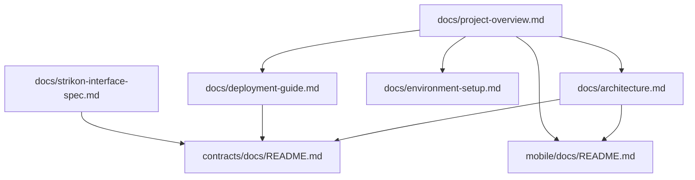

# Root Docs Map

## Canonical Root Docs

| Document | Role |
|:---|:---|
| [architecture.md](architecture.md) | Top-level architecture narrative and current implementation/planning boundary map |
| [project-overview.md](project-overview.md) | Repository scope, deployment units, and current surface summary |
| [deployment-guide.md](deployment-guide.md) | Deployment guide for the target L1, contracts, and mobile app |
| [environment-setup.md](environment-setup.md) | Full development environment and target-L1 reference setup |
| [platform-policies.md](platform-policies.md) | Summary of top-level policies |
| [strikon-interface-spec.md](strikon-interface-spec.md) | STRIKON → EnergyFi data boundary |

## Supporting Docs

| Location | Role |
|:---|:---|
| [`../contracts/docs/`](../contracts/docs/) | Contract-layer canonical specs |
| [`../mobile/docs/README.md`](../mobile/docs/README.md) | Index of mobile UX and screen-design documents |
| [`judge-quick-start.md`](judge-quick-start.md) | Judge-facing verification flow derived from committed code |
| [`contract-deployment-links.md`](contract-deployment-links.md) | Contract evidence set for the judge flow and repo deployment artifact |
| [`archive/`](archive/) | Historical material not used as current design authority |

## Cross-Directory Graph

